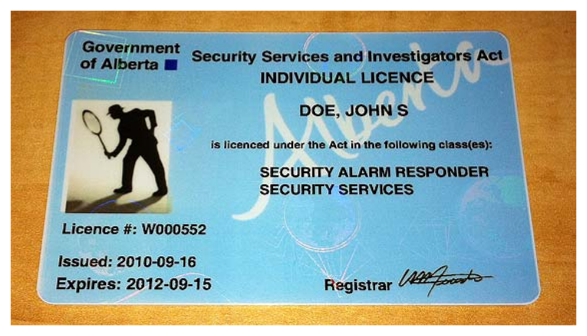
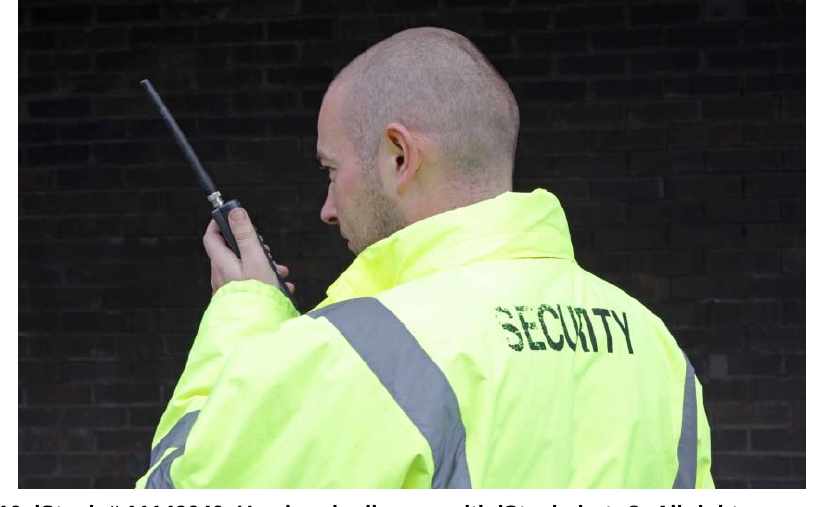

# Legislation and the Licensing of Security Professionals

*Figure 1.1 — Alberta Security Licences*

*Important: not permitted to work without licence*

*Prohibited self-references for licensees*

in Alberta

Alberta introduced the Security Services and Investigators Act (SSIA) on June 1, 2010 to reflect changes in the security industry in recent years, and to provide an industry-wide standard across the province. The Act is the law which is to be followed by individuals and businesses working in the security industry. The Security Services and Investigators Regulation and Security Services and Investigators (Ministerial) Regulation are the accompanying documents which prescribe how the law will be administered and enforced.

This new legislation is likely one of the reasons you are participating in this course; under the new Act, security professionals must be licensed as follows:

Section 3, Security Services and Investigators Act (SSIA) Security services 3(1) No person may, without a licence to do so, for remuneration,

(a) patrol, guard or provide security for another person or for the property or premises of another person, or

(b) detect loss of or damage to the property or premises of another person.

(2) No person may advertise, hold out or offer to provide a service or perform an activity described in subsection (1) unless the person has a licence to provide the service or perform the activity.

© Alberta Queen’s Printer, 2008.

The legislation also defines licensing requirements for loss prevention workers as follows:

Section 6, Security Services and Investigators Act (SSIA) Loss prevention workers 6(1) No person may, without a licence to do so, for remuneration, in plain clothes,

(a) prevent loss of or damage to the commercial, industrial or retail property or premises of another person, or

(b) detect loss of or damage to the commercial, industrial or retail property or premises of another person.

(2) No person may advertise, hold out or offer to provide a service or to perform an activity described in subsection (1) unless the person has a licence to provide the service or to perform the activity.

© Alberta Queen’s Printer, 2008.

Executive Security

Executive security refers to individuals who guard or provide protection to a specific individual requiring personal protection. This licence class is exempt from wearing a uniform if desired. If a uniform is worn, it must be compliant with legislation.

To support the requirement for licensing, Alberta has implemented application procedures for both individuals and businesses. Any individual wishing to apply for a security professional licence in Alberta must meet the following requirements:

• 18 years of age at the time of application

• Canadian citizen or legally entitled to work in Canada

• Competent, and of good character

• No serious criminal record for which no pardon has been received

• No outstanding criminal charges, and must not be the subject of an ongoing criminal
investigation

• Must be fluent in English*

• Successful completion of approved training course for class of licence being sought.
The Alberta Basic Security Training course applies to the following classes of
licence:

o Security Services

o Loss Prevention

o Executive Protection o Patrol Dog Handler o Alarm Responder

• Successful completion of approved training course for baton, if permission to carry a
baton is being sought

*A note about English language requirements:

The Security Services and Investigators (ministerial) Regulation require licensees to communicate effectively with emergency services personnel and with the public while carrying out the duties of a security professional. Where an applicant’s English language skills are in question, language proficiency testing may be required. Contact the Security Programs’ staff if you have concerns about a student’s language skills.

Figure 1.1 Alberta Security Licences

An individual wishing to become licensed as a security professional in the province of Alberta within the following license classes: Security Services, Loss Prevention, Executive Protection, Patrol Dog Handler and Alarm Responder must take the following steps:

1. Complete the application form for Individual licence.

2. Provide copies of approved ID with application form.

3. Provide proof of approved training with application form.

4. Provide Police Information and Criminal Record Check (including CPIC, Vulnerable
Sector, Local Database searches) document with application.

5. Provide one photograph — signed by local police service — with application.

6. Mail, or courier, the application package and the appropriate fee to the Security
Programs office.

Your employer will require a copy of both the front and back of your licence when you begin your employment.

Visit www.securityprograms.alberta.ca for application forms and information on licensing.

IMPORTANT:

You are not permitted to work until you have received your licence.

The SSIA also provides the criteria under which an application for licensure may be refused.

yi ‘i -_-

© 2010. iStock # 11149040. Used under licence with iStockphoto®. All rights reserved.

Section 16, Security Services and Investigators Act (SSIA)

Refusal of licence application

16(1) The Registrar may refuse to issue a licence or refuse to renew a licence if the Registrar is satisfied that the applicant

(a) has contravened or is contravening this Act or the regulations,

(b) has not met the requirements of this Act or the regulations,

(c) has provided false or misleading information in the application for a licence or renewal of a licence or in any report or information required to be provided under this Act or the regulations,

(d) in the case of an application for renewal of a licence,

(i) has not complied with the terms or conditions of a licence, or

(ii) has not provided a report or information required by this Act, the regulations or the Registrar,

(e) in the opinion of the Registrar, is not a fit and proper person to be issued or to continue to

hold a licence, or (f) has been charged with a criminal offence.

(2) If the Registrar, on reasonable grounds, believes that it is not in the public interest to issue or renew a licence, the Registrar may refuse to do so.

(3) For the purpose of determining whether to issue or renew a licence, the Registrar may collect personal information as defined in the Freedom of Information and Protection of Privacy Act or personal employee information as defined in the Personal Information Protection Act from the applicant or, if the applicant's employer is a business licensee, from the applicant’s employer.

© Alberta Queen’s Printer, 2008.

Section 17 of the Act states the licence is not transferrable and S. 18 describes the obligations of individuals who are granted a licence. These obligations include reporting to the Registrar, in writing, if you

• change your address; or,

• have achange in any of the information you provided to the Registrar when you
made application for your licence (e.g., updated criminal record information, renewed
work permit).

You are also obligated to provide information as requested by the Registrar, and, in accordance with the Regulations, you must abide by the following:

Section 3, Security Services and Investigators Regulation (AR 52/2010) Individual licensee reporting requirements

3(1) An individual licensee who is arrested or charged with an offence under the Criminal Code (Canada) or the Controlled Drugs and Substances Act (Canada) or any other enactment of Canada must, within 24 hours, provide a report to the Registrar in writing of the arrest or charge laid.

(2) If an individual licensee loses his or her licence, the individual licensee must, within 24 hours, report the loss to the Registrar in writing.

(3) An individual licensee must report a change in information described under section 18(a) or (b) of the Act to the Registrar in writing within 30 days of the change.

(4) If an individual licensee fails to comply with this section, the Registrar may cancel or suspend the individual licensee’s licence or impose additional terms and conditions on the individual licensee’s licence.

© Alberta Queen’s Printer, 2010.

<<activity form>>

Finally, the SSIA contains prohibitions regarding how you may refer to yourself, or your duties. An individual holding a security professional licence may not refer to themselves as a

• private detective;

• law enforcement officer;
• protection officer; or,

• security officer.

Public Complaints The Security Services and Investigators Act allows for complaints against security professionals. A complaint against an individual holding a security licence must be made

within 90 days of the occurrence of the alleged incident and in accordance with the following process.

Complaint Process Under the Security Services and Investigators Act

complaint.

A complaint must contain
• the reason for the complaint; and,

• details about the incident for which the complaint is being
made.

A complaint must be filed within 90 days of the alleged incident.

With consent of both parties, the employer may attempt to resolve the issue between the security professional and the complainant.

4

to complainant and licensed security professional within 30 days of receipt of complaint.

Organization will complete investigation into complaint and provide written notice of outcome to complainant and licensed security professional within 90 days of receipt of complaint.

If criminal activity is alleged, a police investigation will take place.

Dl

The complaint process under the SSIA also permits review in the case where the decision of the organization or business owner is not satisfactory to the complainant. A complainant who wishes to appeal the decision made by the employer of the subject security professional may request the Registrar to review the decision. The complainant must make a written request to the office of the Registrar within 30 days of receiving written notice of the employer/organization’s decision in the matter.

Complainants who remain unsatisfied after review and decision by the Registrar may submit, in writing, a request for review by the Director of Law Enforcement at the office of the Solicitor General and Ministry of Public Security. The Director will advise the complainant, in writing, of the process and timeline associated with the review. The decision of the Director regarding the outcome of the complaint is final.
