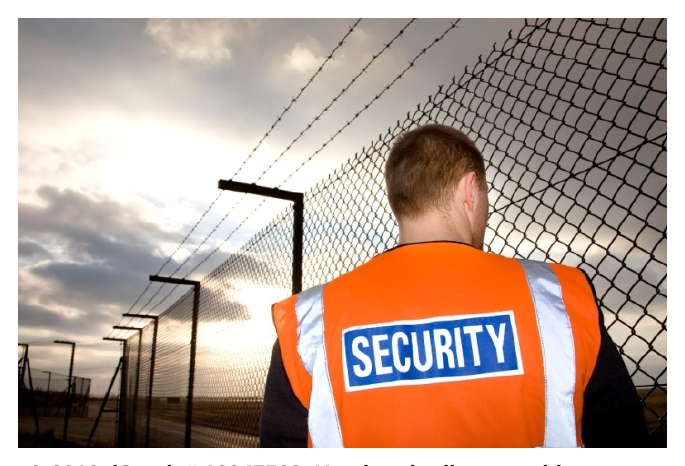

# Appearance and Conduct for Security Professionals

*Professional appearance illustration*

Appearance

You never get a second chance to make a first impression — how many times have you heard that expression? It is often true, and is something you should consider as you enter into the security profession. The public will immediately recognize and respect — or not respect - you in your role based on your appearance, and how you conduct yourself. If your appearance is unkempt and your manner casual, or inappropriate, then likely the people around will think you hold equal disregard for the job you are tasked to do. Putting on a professional attitude, communicating with courtesy and taking care that your uniform is clean and neat helps you to feel better about yourself, and inspires confidence in the people who are looking to you for guidance and protection.

THE BOTTOM LINE IS, IF YOU TAKE YOURSELF SERIOUSLY, OTHERS WILL TAKE YOU SERIOUSLY.

Your apparel while working as a security professional will be designated by your employer in accordance with the provisions of Part 7, Security Services and Investigators Act.

Section 34, Security Services and Investigators Act (SSIA) Uniforms and weapons

34(1) An individual licensee must wear the uniform and insignia specified in the regulations for that class of licensees.

(2) An individual licensee shall not have in the licensee’s possession any weapons or equipment except those specified in the regulations or authorized by the Registrar.

© Alberta Queen’s Printer, 2008.

Your employer will have a dress code for your organization; your required uniform may vary depending on the type of assignment you are given. For example, additional, safety-oriented clothing may be in order if you are working a large event, or directing traffic. You may be required to wear business attire for executive protection or loss prevention work. You may also be asked to cover up piercings or tattoos, which some | clients may feel are unprofessional —_© 2010. istock # 12247523. Used under licence with in appearance. Even if your iStockphoto®. All rights reserved.

company does not provide specific

guidelines, it is in your best interest to portray a professional appearance as follows:

• Uniform clean, in good repair (e.g., no rips or missing buttons) and pressed

• Hair clean and neatly combed; you should securely tie long hair back for neatness,
and for safety purposes

• Shoes should be clean and shined; comfortable shoes will go a long way to keeping
an unprofessional frown off your face

• Jewellery should be simple, and not excessive; long necklaces or dangling earrings
are hazards in situations where you must protect yourself or others.

It goes without saying that getting the right amount of sleep, eating well, and regular exercise are good for your mental and physical health. Many times, security professionals are called upon to work late-night shifts, or long hours. Taking care of your mind and your body are the best defence against fatigue, and have the added benefit of providing you the strength you need in case you are called upon to defend yourself, or your client(s).

Conduct

A word which has been associated with the military, law enforcement, and the security industry is deportment. Deportment describes the conduct and behaviour of an individual. Another word associated with deportment is demeanour, which describes how an individual responds to other people, or his/her environment. Good deportment is necessary in your interactions with the public, as well as your relationships with your colleagues, supervisor, and other members of your organization. Remember, you are part of a team; helping your team be the best they can will ultimately make you successful and keep you safe on the job.

6.1 Code of Conduct

To ensure program integrity all participants are held to a common standard as it relates to a code of conduct. In developing a common standard that encompasses all aspects of licensee conduct, the legislation will ensure consistency in service delivery and strengthen the integrity of the program.

Business licensees are directly responsible for ensuring internal human resource documentation incorporates the Code of Conduct required by section 20 of the Ministerial Regulation.

The Code of Conduct found in section 20 of the Ministerial Regulation is designed to ensure minimum standards and is not exhaustive. Business licensees are encouraged to add to this Code of Conduct to meet agency or corporate needs.

While on duty, every licensee (business or individual) shall abide by the following code of conduct:

A licensee will:

• Act with honesty and integrity,

• Comply with all federal, provincial and municipal laws,

• Respect the privacy of others by treating all information received while working as a
licensee as confidential, except where disclosure is required as part of such work, by
law, or under the Personal Information Protection Act,

• Abide by their employer's code of conduct in addition to the provisions of this code of
conduct.

A licensee will not:

• Engage in disorderly or inappropriate conduct,

• Use unnecessary force,

• Withhold or suppress information, complaints or reports about any other licensee,
• Wilfully or negligently make or sign false, misleading or inaccurate statements,

• Consume alcohol,

• Consume controlled drugs or controlled substances under the Controlled Drugs and
Substances Act (Canada),

• Possess controlled drugs or controlled substances the possession of which is
prohibited by the Controlled Drugs and Substances Act (Canada).

SSIA Policy Manual © Solicitor General of Alberta

<<discussion form>>
