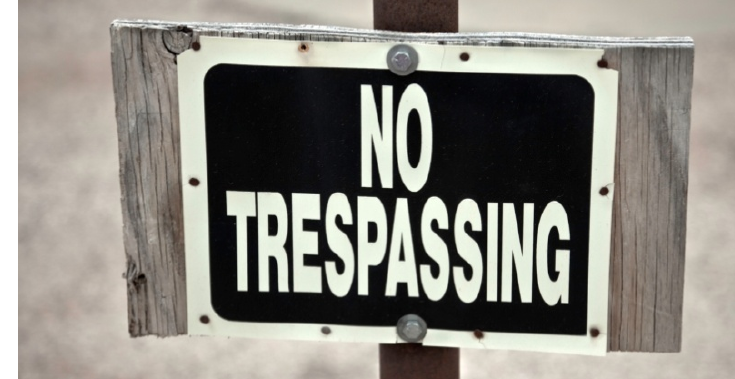

# Trespass to Premises Act

*ProServe illustration*

As you have probably noticed, the potential for you to encounter trespassers while working as a security professional is quite likely. The Act clearly provides authorization for you — as a representative of the owner — to enforce the provisions made under the Act.

Section 2, Trespass to Premises Act Trespass 2(1) No person shall trespass on premises with respect to which that person has had notice not to trespass. (2) For the purposes of subsection (1), notice not to trespass may be given to a person (a) orally or in writing by the owner or an authorized representative of the owner, or (b) by signs visibly displayed (i) at each of the entrances normally used by persons to enter the premises, and

(ii) in the case of premises referred to in section 1(c)(ii), at all fence corners or, if there is no fence, at each corner of the premises.

(3) For the purposes of subsection (1), a person is deemed to have had notice not to trespass when signs are displayed in accordance with subsection (2)(b).

1997 cT-8.5 s2

© Alberta Queen's Printer, 2004

wey

© 2010. iStock # 13929320. Used under licence wi iStockphoto®. All rights reserved.

Section 4 of the Act relates to a driver who trespasses on the premises by way of motor vehicle.

Section 4, Trespass to Premises Act Liability of driver

4 When atrespass is committed by means of a motor vehicle, the driver of the vehicle is guilty of the contravention of this Act and liable to the fine.

1997 cT-8.5 s4

© Alberta Queen's Printer, 2004

And, as you have already learned, you have authority to arrest a trespasser as follows:

Section 5, Trespass to Premises Act

Arrest without warrant

5(1) A trespasser may be apprehended without warrant by (a) any peace officer, or

(b) the owner or an authorized representative of the owner of the premises in respect of which the trespass is committed.

(2) Where a person other than a peace officer apprehends a trespasser, that person shall deliver that trespasser to a peace officer as soon as practicable.

1997 cT-8.5 s5.

© Alberta Queen's Printer, 2004

Dl
