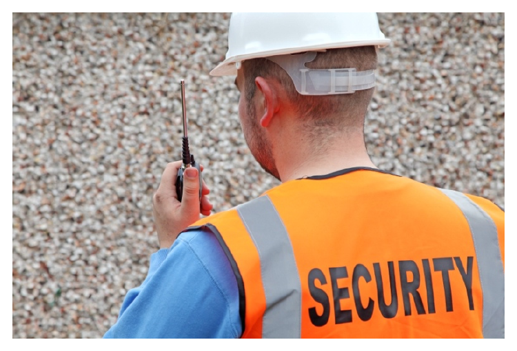
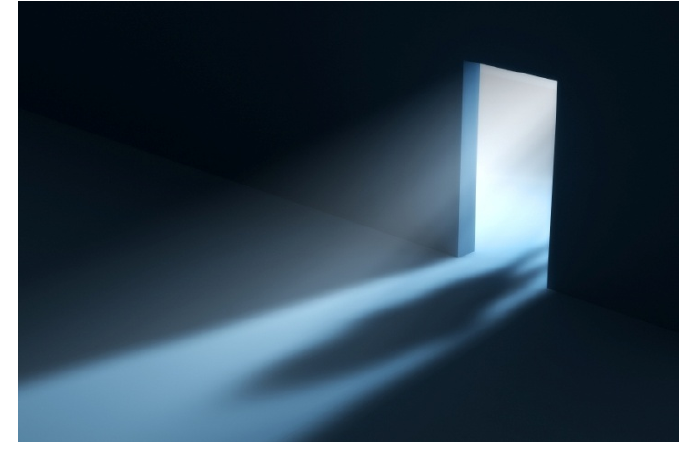
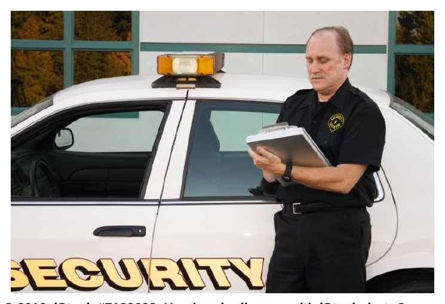
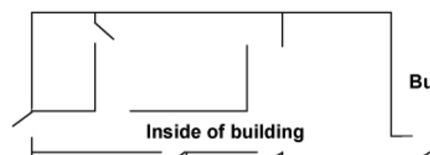
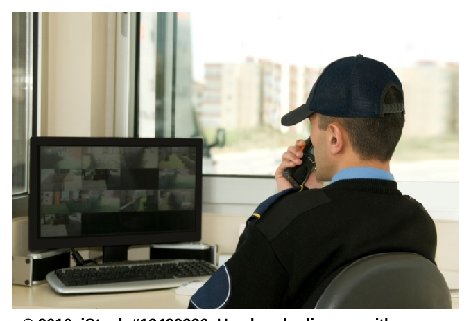
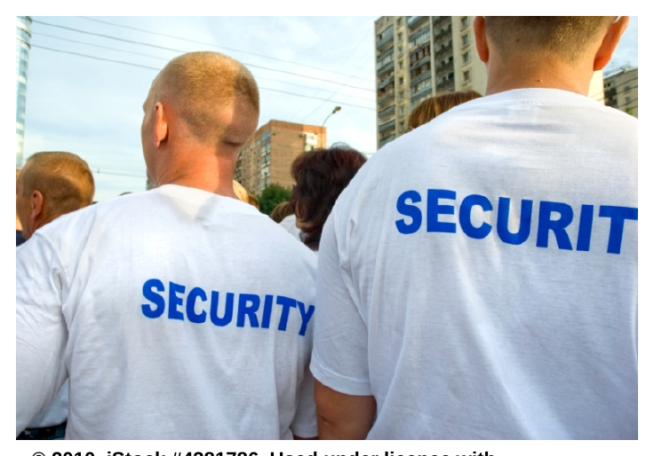

# Patrol Skills

*Patrol equipment illustration*

*Foot patrol illustration*

*Vehicle patrol illustration*

*Figure 3.2 — Vehicle patrol*

*Surveillance illustration*

*Crowd control illustration*

Patrolling is making an active survey of the persons or property you are tasked with protecting. When you patrol, you are making your presence known; in many cases, the sight of a uniformed guard is sufficient to keep potential troublemakers away.

However, patrolling is more than just walking around your assigned area or site; it involves being actively aware of your surroundings and of changes to persons and property within those surroundings. You must be continually observant and mindful of the presence of individuals who should — or should not — be there.

| Be prepared! I

Before starting your shift, make sure you are physically and mentally prepared to carry out your duties. Everybody has distractions in their life and, sometimes, getting to work seems a bit of a challenge. In order for you to be effective in protecting persons and property, you need to be able to protect yourself first. You give yourself the best chance of being ready for an incident when you have made sure you are ready to perform your duties before your shift begins.

Dl

Physical preparedness

Mental preparedness

Take stock of the following prior to starting your shift:

Are you feeling well?

0 Take care of your health by eating right and exercising regularly

o Make sure you get enough sleep

0 Going to work when you are ill is a hazard to yourself and to those you work with; if you are sick, call your supervisor

Uniform and duty belt?

o Ensure your clothing is clean, pressed, and properly mended

o Make sure your uniform is complete; don’t forget anything, such as your name badge or licence

o Check that items on your duty belt are securely fastened, in good working order, and that no items are missing

Keys, notebook, pen, radio, or phone — have them ready If you have a radio, test to ensure it is working

Post orders — review, discuss with supervisor if required

Deal with distractions prior to starting your shift, or set a time to deal with them after your shift ends, allowing you to concentrate on your duties

Get focused on the task at hand

Review your assignment, making a mental list of what you must accomplish and how you will do so

When you receive your orders from your employer, you will likely be given instructions as to specific persons or events to watch for. You may be provided with a list of individuals who are permitted to enter, or you may be asked to report certain events, even though they do not appear (to you) to be worrisome. It is also not your job to monitor the specific activities of persons permitted to work on the site. For example, you may be on a construction site where a sub-contractor’s crew is performing an installation. Your job is to be aware of their presence and be observant that their activities are not harming the persons and property you are there to protect, but it is not your job to monitor the length of their breaks or how much work is being done by each individual. Nor is it your job to monitor the quality of their work, unless their activity is causing harm to the people or goods you are there to protect. In that instance, you communicate to them about the damage being done and not about their skills or methods in completing the work.

rr

Upon arriving at your post, take time to survey the area; after all, how will you be able to determine when things have changed if you don't know what they look like to begin with? Familiarize yourself with any persons on the site and any anticipated arrivals, either of persons or property. Find out if there are any extra events anticipated, such as a scheduled fire drill, or a site inspection. Knowing what to expect during your shift is part of being a well-

prepared security professional. © 2010. iStock # 13786328. Used under licence with iStockphoto®. All rights reserved.

Develop a pattern for your patrol

duties; once you have memorized it you will have one less thing to think about which means you can concentrate better on your actual patrolling duties. For example, you might make it your habit to move from the ground floor up through the top floor in your regular patrol of a multi-storey building. Or, if your duties involve checking in with specific persons, you might contact those individuals in the same order each time. No matter what kind of system you work out, be sure to guard against complacency. Being complacent means you make a lot of assumptions based on prior experience, such as “everything looks pretty much the same as last time, so all is well,” or, “the wind has blown that door open a bunch of times in the past, that’s all it is tonight.” It might be that yet again, the wind has caused the door to open, but at least you can move on with the assurance you have done right by your employer and the client.

Patrol by Foot

At some point in your career as a security professional, you will most likely carry out foot patrol. It is the most common method of patrolling, and is the most appropriate method for many of the settings you can expect to work in. Office buildings, retail settings, sport or concert venues, and airports are more suited to patrol by foot than by vehicle.

Foot patrol allows you to not be distracted by the operation of the vehicle and the mental processes required for safe and proper driving. From a vehicle, it is more difficult to hear the sound of a window breaking, or to notice the smell of smoke. Conducting your patrol on foot allows you to use all of your senses, and makes it easier for you to stay close to the persons or property you are tasked with protecting. When on foot, you are able to access secluded areas, such as stairwells, and you have more opportunity to interact with the people you may be helping protect. Having a chance to chat or find out about things that are going on helps you to be more aware of the setting and even more aware of when things aren't quite right.

Dl

Some points to consider when carrying out foot patrol:

If you are able to see into areas before physically stepping into them (via CCTV), do so

When patrolling in a parking lot or parkade, walk on the side of the roadway, as you may not see or hear a car approaching

Do not use a portable stereo system (e.g., MP3 player) while on duty; it will interfere with your sense of hearing, particularly at night or in dimly lit areas

Smoking while on duty will affect your sense of smell and, therefore, your ability to detect unusual odours. In the day, it will take away from your appearance as a professional. At night, a lit cigarette is an indicator of your presence — the lit end of your cigarette and the smell of smoke both serve as warnings to potential intruders.

When approaching an unknown situation at night, consider your stance with respect to the light; try not to create a silhouette of yourself, as it will make you readily

visible. This is especially true near a windows and doors. At night, walk quietly so as not to

announce your presence; startling

a potential intruder may put you © 2010. iStock # 3423707. Used under licence with iStockphoto®. in an unsafe position All rights reserved.

Carrying Out a Basic Patrol

Bring your radio, notebook, pen, and any other equipment you would normally carry. The purpose of patrol is to look for signs of trouble; you want to be as prepared as possible in case you find what you are looking for.

Walk confidently about the property or premises. Be professional as others are watching you. Engage in exchanging quick bits of conversation (e.g., say hello in return if someone greets you) or answering simple questions (e.g., if someone asks where it is okay to park) but do not become engrossed in lengthy conversations. First of all, you are paid to be protecting persons and property as directed by your employer and second, an ongoing conversation could serve as a distraction to keep you from noticing other activity taking place.

rr

Follow a consistent route through or around the premises; you should make a routine to ensure you have covered all areas you are responsible for. Be careful, however, not to become so familiar with your route that you stop looking closely enough to notice when things are amiss.

Check doors and windows as you walk by; if they should normally be locked, ensure they are with each pass of the location.

Look for signs that something is amiss. People involved in odd behaviour are worth a second glance (e.g., an individual trying to open car doors, moving from one vehicle to the next). Objects or items which appear out of place should be investigated. Use your senses to let you know when something is “not quite right.”

In conditions of poor lighting, shine your light into the room or space before entering so that you may see what is there (or not there); it is easy for somebody to hide in the dark and take you by surprise.

Record anything unusual in your notebook.

Contact the police if you find evidence suggesting a criminal act has

taken place. eee

Patrolling for Loss Prevention

Loss prevention is the industry term for security professionals tasked with protecting the saleable goods in a retail setting. Stores will utilize different approaches to loss prevention based on their resources and needs; for example, large department stores usually have more revenue to allocate to security whereas a smaller, independent family business may be more limited. The amount of protection should be in keeping with the value of the goods, the ease of access, and the likelihood of theft. Goods which are relatively inexpensive and difficult to access may not require the same level of protection as expensive merchandise displayed in an easily accessed area of the store and may, therefore, be more vulnerable to shoplifting.

Security professionals working in loss prevention should seek clear direction from their supervisor (and ultimately, the client) regarding merchandise considered to be “priorities” when it comes to protection. You may want to discuss the types of goods which are typically stolen and set up your patrols to ensure particular attention to the areas where theft frequently occurs. If you are working in a loss prevention role and notice certain goods or areas of the store appear to be frequent targets of shoplifters, you should bring it to your supervisor's attention; this will help the client to make a better informed decision as to how goods are displayed which may help to reduce the losses.

Loss prevention workers typically conduct their duties through surveillance; several different methods are used, including:

• Security cameras (CCTV)

• Plain-clothes loss prevention workers

Regardless of the manner in which the shoplifter is detected, it is important to remember that the offence of theft should not be considered to have occurred until the subject passes all cashiers and has left the store.

Loss prevention workers should pay close attention to individuals

• Appearing “furtive,” or looking around at fellow shoppers or staff

• Looking in the direction of security cameras

• Wearing unusually bulky clothes (e.g., a large winter coat on a very warm day)

• Carrying large bags or backpacks

rr

Patrol Using a Vehicle

Some employers will provide a vehicle (e.g., car, SUV, bicycle) for you to carry out your patrols. This is more common where a large site is involved, such as a construction site, or perhaps in the parking lot of a large venue. Where the site to be protected is very large, a vehicle brings the advantage of being able to cover a large amount of area quicker than if you were on foot. You are also able to respond to events faster when traveling by

ANY (AN AYN vehicle and you may be able to

© 2010. iStock #7180693. Used under licence with iStockphoto®. carry more equipment, such as a All rights reserved. first aid kit

Controlling Access

As a security professional, you are acting on the owner's behalf to monitor and control access to persons or property as directed by your employer. You should receive clear instructions as to who is permitted access and what is granted by allowing that access. Depending upon the setting, the permissions may change from individual to individual. One common example is a concert; in some venues, people wishing to access the seating areas on the floor must be in possession of a ticket for a seat specifically in that area. Individuals who have tickets for the raised seating are not permitted access. Another example may be on a construction site or a remote location, where access to certain areas may only be given to those who are wearing appropriate safety equipment, such as a hardhat and steel-toed boots.

One thing to remember is it is not your job to question why access is different between persons; do not let an individual persuade you to enter a restricted area through their use of a good argument or an emotional plea. You may, if time and circumstances allow, wish to make note of the request and advise the person you will bring it up to your supervisor at a later point. If the individual is persistent and keeps you from properly carrying out your duties, you should call your supervisor, or your designated contact at the site, if applicable, to seek direction. If no such contact is available, you must stand your ground and continue to deny access. If the individual continues to be bothersome, you should ask them to leave. If they do not leave, advise them you will have to treat the incident as one of trespassing. If they still refuse to leave, you will need to deal with the person as you would with any other trespasser.

rr

Access Control Areas

Building Perimeter | | and | Inside of building Entrance

4 |

Property Perimeter

Figure 3.2 Choose points where a security guard would typically deal with access

Access to persons or property generally decreases near individuals of status, for example the president of an organization, or, near critical locations within the property. This could include the mechanical systems room, vaults, or areas near items of great value, such as a prized piece of art, or the expensive

pieces of jewellery in a retail setting. Individuals who Important point are permitted to enter areas of controlled access are Take care when usually provided with a means by which to enter. This looking at ID; make could include a key, swipe card, ticket, or ID card. At sure the photo on the certain functions, an individual trying to gain access card matches the may be required to present you with an invitation. individual standing

Some sites maintain a document listing the names of before you. individuals who are permitted access to the location. In some small settings, you may be introduced to the individuals who work or live there and grant access based on recognizing them as they enter. In a setting like that, be sure to find out from your supervisor what the access policy is when those individuals bring another person with them.

In some cases, you will be concerned with individuals who are leaving the premises. Some organizations require individuals to sign out when they leave the building, or to turn in certain equipment, or items such as keys, at the end of their shift. If you are required to collect items from departing persons, make sure to find out what those items are and what to do with them once they are in your possession.

rr

Surveillance

Surveillance is another way of saying you are carrying out patrol duties from a fixed position. In some cases, you may have assistance of closed- circuit television (CCTV) monitors. Examples where this type of technology is used include banks, office towers, retail stores, and hotels. In some cases, the security professional is posted in a lobby and watches the monitors from that position, while in other settings the monitors are housed in a separate — . .

, © 2010. iStock #13429326. Used under licence with room where a security guard may be iStockphoto®. Alll rights reserved. posted to keep constant watch. A CCTV system may be helpful when there is a large area to be covered; many times, security monitors are used along with mobile foot or vehicle patrols.

You should use the same processes and safety considerations when carrying out surveillance as you would use on a standard foot patrol.

Video Footage from Labour Disputes

You may be required, at some point, to perform surveillance duties which include gathering video footage at a labour dispute. Some picket lines which form as a result of a labour dispute have erupted into violence and conflict between the two sides involved in the bargaining process. Business owners suffer losses when such conflicts escalate to acts of vandalism and individuals may be injured as a result of assault. Video footage of such events is helpful for the investigation and subsequent court proceedings. Images gathered through video-taping should be secured and turned over to your supervisor as soon as possible; keep in mind images taken without an individual’s consent should be used only for the purposes of the investigation. Under no circumstances should you telease photos or video footage to the media, or use such material in any other manner (e.g., social networking sites, the Internet).

Alarms

Another form of surveillance is the monitoring of alarms. Most premises have fire alarms on site, and an increasing number of locations have “burglar” or security alarm systems in place. When assuming your post, take time to find out what alarm system(s) might be in place and what procedures must be followed should an alarm be sounded. You should determine the location of the alarm panel and be able to understand any lights, sounds, or other indicators which may be triggered. You should also familiarize yourself with the basic operation of the panel if you are required to operate the system.

rr

Some alarm systems trigger an automatic request for help while others require a manual notification to emergency services. In addition to

* calling in the alarm, you may be required to perform additional duties, such as performing a check for occupants and subsequently ensuring individuals leave the premises in a safe, orderly manner. Remember, you have been hired by your employer to

_ protect designated persons or property; this remains

true even during an alarm situation.

in

= | Insome cases, you may be instructed to investigate © 2010. iStock #5329859. Used under the cause of an alarm; for example, some alarms are licence with iStockphoto®. All rights routed through a security monitoring company — reserved. perhaps even the company you work for! A dispatcher in the office may call to advise you a report of an alarm has been received, and you may be asked to follow up on the situation.

Many large facilities have alarm systems in place to monitor building operation functions, such as the heating/cooling system or water. You may be required to monitor these types of alarms; make sure you have a clear understanding of the procedure you must follow in the event an alarm is activated.

Alarm Responders

Many organizations and home owners contract security firms to handle after-hours alarm responses. When an alarm monitoring firm receives notification of an alarm, the call to respond is dispatched to the security company. Your employer may be contracted to respond to alarm calls within a certain time limit; if you are dispatched in response to an alarm, you should:

e¢ Obey all traffic laws when traveling to the location of the alarm; as a security professional you have no special authority to travel at a higher rate of speed or ignore traffic signal devices

• Upon arrival at the scene check to see if doors and windows are secure; make note
of any which appear to be open, unlocked, or otherwise unsecured

• If you see evidence of a break in or other criminal activity, notify the police
immediately; document your findings and take care not to displace or destroy
evidence

• Becontinually observant while attending at the premises

• Incases where you find the premises not to be secure (e.g., an open or unlocked
door or window), notify the police who will advise you if they will attend the scene

• Follow protocol for advising the alarm key-holder (usually an employee of the
company where the alarm is located) to reset the system

• Document events in your notebook and prepare any reports as required

rr

Control Crowds

Groups of people can quickly become crowds when some central feature or activity becomes the focus of everyone's attention. Even places which are not normally associated with crowds can become congested with people under certain circumstances. Places where you might encounter crowds in the course of your security duties include

¢ Sporting events or concerts

• Retail stores (e.g., Boxing Day shopping events or new product release)
• Demonstrations or protest rallies

• Labour disputes

¢ Emergency scenes

Crowd behaviour can be influenced by a multitude of factors, with two of the most common being the emotional status of the crowd, and the presence of leaders.

Sporting Events or Concerts

Events such as these attract large numbers of spectators. Most attendees will generally follow the rules; however, the sheer volume of individuals present at such an event can cause a disturbance amongst the crowd to escalate quite quickly. In addition to the large number of people, other factors which can cause this type of crowd to get out of hand include i: Us the availability of alcohol at the © 2010. iStock #4381786. Used under licence with venue, and the potential for iStockphoto®. All rights reserved.

rivalry (e.g., a sporting event attended by fans of both teams). These types of crowds are generally unorganized, with no formal leader at the outset.

Retail Stores

In recent years, it has become common for lines to form outside of retail stores in anticipation of a new product release, such as a specific cell phone or video game console. When supplies of the product are anticipated to be limited, hype is often generated causing consumers to line up a day or more in advance so they may be first in line when the product hits the shelves. While the atmosphere usually starts out as somewhat festive, fatigue resulting from the long wait combined with discomfort in the form of hunger or cold (depending on weather) can deflate the spirits of shoppers, potentially leading to altercations with the potential to involve the larger crowd. However, the line outside the store is not usually as concerning as the mob which gathers upon

Dl

the opening of the main doors. This situation is also true of certain shopping days, such as Boxing Day, where large numbers of shoppers come in anticipation of finding deeply discounted merchandise. Retail stores are not well-designed for large crowds; anxious shoppers in close proximity to one another combined with limited supply of goods can lead to commotion, misunderstanding, and an uncontrolled free-for-all.

Demonstrations or Protest Rallies

Humanitarian and political causes often draw people to come together to show their support or opposition to what is generally perceived (at least by one side of the debate) to be a controversial issue. Individuals in attendance at such events usually have strong feelings which lead them to participate in this type of public gathering, causing the participants to be charged with an emotional energy. Most often, there are representatives of “the other side” of the issue in attendance; while they may be there to simply make their side of the story heard, they may also be there to heckle those who are gathered. While the number of people in attendance may not be significant, the potential for disturbance to occur when emotionally charged individuals are provoked must be considered. It is usually possible to identify leaders in the crowd for both sides of the issue.

Labour Disputes

Striking workers are spouses, parents, students, and other responsible individuals who find themselves in a position where they are unable to work and support their family. Emotion generally runs high among such a crowd. Collective agreements often call for worker participation in picket lines; employers often hire non-union labour to meet production demands during a strike, and conflict may occur when the two parties come in contact with one another at the job-site. The term “organized labour” should provide a clue that an individual or group of individuals is rallying the troops to make their case heard.

Emergency Scenes

People are, by nature, rather curious, which leads them to check out accident scenes and other locations where emergency personnel are present. For the most part, observers gathered at the scene are just inquisitive and generally not there to make trouble. It can, however, be quite problematic for emergency services workers to deal with the situation at hand when they are overrun with curious onlookers. Appealing to their need for safety and the requirement for emergency crews to have room to work will generally be sufficient in getting the crowd to leave. Sometimes though, persons gathered at the scene may do so because they believe a loved one is at the location of the event, such as a parent responding to a report of a fire at their child’s school. This type of response is generally accompanied by strong emotion, such as fear, making it more challenging to deal with moving the individual away from the scene. They may respond emotionally to your request to leave which could spark additional emotion and the attention of other, similar observers. While no leader is generally apparent, the potential for this type of crowd situation to escalate is very real, and must be considered.

rr

Strategies for Dealing with a Crowd

Dealing with a crowd as a lone security professional will be a challenge, and you will likely not be able to contain an out-of-control crowd on your own. Remain focused on your objective, which is to protect persons and property. This will be easier said than done in some situations. Call for back-up at the first sign of an incident as it can turn from something minor into something quite large.

Remove the Leaders

One strategy you should keep in mind is to always try to de-escalate (calm down) a crowd situation before it happens. If you notice a crowd beginning to form or you see an individual or individuals encouraging others to join in inappropriate behaviour, step in quickly to remove the leader(s) from the group. Take the individual(s) aside and ask them to stop the behaviour. If they are compliant, take a couple of minutes to thank them for their cooperation and let them return to the group. If they are not compliant, or if they return to the group and resume the problem behaviour, you will need to speak with the individual(s) again. You will need to advise them their behaviour cannot continue and if they choose to do so, they will need to leave the premises. It may not be easy gaining compliance or removing the individual(s) at the root of the problem, but it will be a simpler task than trying to end a fully developed crowd control problem. As always, you will need to use professional communication (which we will discuss in a later module) even if the individual(s) are not cooperative. Resort to non-verbal measures only after exhausting your other options. Be sure to make the appropriate entries into your notebook following the incident.

Break the Crowd into Smaller Groups

Crowds draw their energy and intensity from their numbers; a large group of people worked into an emotional frenzy is a powerful force. If you are able to persuade people to wander off or become interested in something else, you will break down the momentum of the crowd which may keep the incident from escalating into something more serious. You will likely need assistance to deal with a large group; if you are working a large event, chances are there are other security professionals who may be able to help.

Seek Help from a Sympathetic Leader in the Crowd

In some cases, you may be able to ask an individual in the crowd for assistance in gaining control. It may be the case where there is a respected leader or community figure present who may be able to influence the activity of the crowd. If the individual is willing to assist, allow them a chance to influence the group into a calmer state. Make sure you “have their back” while they are trying to help out.

rr

Panic Situations

In the case of an emergency, crowds will typically “stampede” as they try to escape the venue. It is extremely difficult to control individuals when this happens; people are primarily concerned with reaching safety and focused primarily on their own well-being. This type of crowd is extremely dangerous and can lead to individuals’ tripping, falling, and being trampled. You may find yourself being quite anxious in this type of situation but you will need to do your best to remain calm and composed, despite the chaos surrounding you. Address the crowd confidently and assertively with enough volume to be heard but without yelling. Yelling and screaming are signs of losing control and you must do your best to convince the crowd that you are confidently facing the situation. Threats and use of force will only increase the level of fear and panic in the crowd.
