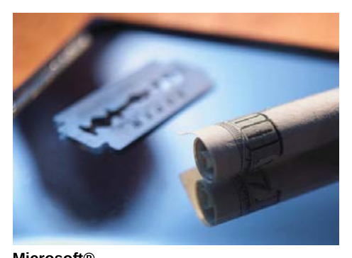

# Dealing with Substance Abusers

*Substance abuse indicators*

Unfortunately, substance abuse occurs in all our communities and in the course of your work, you will most likely encounter an individual with a drug or alcohol abuse problem. An individual is considered to be addicted to a substance when they

• Give up activities, hobbies, friends, and relationships they formerly enjoyed in order
to spend time using/abusing a substance

• Will continue to use/abuse the substance even if doing so has negative effects on
their well-being (e.g., health, financial, relationships)

• Experience physical symptoms when they stop drinking or using drugs (withdrawal)

As a security professional, you will encounter drug and alcohol abusers in situations such as these:

• —_Loitering - hanging around with fellow users, or waiting to buy more drugs

• Shoplifting - stealing items to sell in exchange for drugs, stealing necessities
because they no longer have a job or the finances to purchase what they need

• Creating a disturbance - being drunk or high, and not in control

•  Trespassing - entering a premises looking for drugs or alcohol, or the money to
purchase things

• Break and enter (with the intent to steal money or items to use to obtain more drugs
or alcohol)

Signs and Behaviours

There are many indicators which may suggest an individual is abusing drugs or alcohol. The signs and behaviours shown below may indicate an individual has a substance abuse problem, or, they may be symptoms of another problem. You will need to observe and ask questions, analyze your information, and make the best decision you can. It is not your responsibility to diagnose or treat a drug or alcohol abuse problem; however, recognizing some of the common signs may help you in your interactions with addicted individuals.

rr

Physical

¢ Blood shot eyes

• Pupils larger or smaller
than usual

• Changes in appetite or
sleep patterns; sudden
weight loss or gain

• Deteriorated physical
appearance, poor
grooming

• Unusual smells on
breath, body, or clothing

• Tremors (shaking),
slurred speech, poor
coordination

Behavioural

Poor attendance at work or school

Unexplained need for money; may borrow or steal

Secretive or suspicious behaviour

Sudden change in friends, favourite hangouts, hobbies

Getting into fights, accidents, or illegal activities

.

Psychological Sudden change in personality or attitude

Mood swings, irritability, angry outbursts

Hyperactivity, agitation, giddiness

Lack of motivation Lethargic

“Spaced out”

Fearful, anxious Paranoid for no reason

Adapted from Helpguide (2010)

You can see from the table above that dealing with an individual who abuses a substance may not be easy, especially if they are drunk or high. It may not be possible to reason with them, and they may be incapable of understanding or following your instructions. If the person refuses to stop a particular behaviour or leave the premises after you have asked them to, you will need to call the police to intervene. If you come across an individual who appears to be having a health emergency as a result of their drug or alcohol use, call for EMS immediately.

Identify Drug Paraphernalia

Drug paraphernalia refers to items which are used to package, make, use, or conceal illegal drugs (Sunshine Coast Health Centre, 2009).

Illegal drugs may be packaged in small plastic bags, glass vials, small flaps of shiny paper, and tiny plastic sacks (sometimes called “8-balls”). Prescription drugs which are being abused can come as tablets, capsules, or liquid and may be in the original packaging. “Club drugs” are sold as tablets and made to look like candy.

Items for using drugs can include metal foil, “roach” clips, smoking pipes made of glass or metal, other metal or glass objects such as broken light bulbs, bottle caps, or pop cans. Users of injection drugs will have syringes, spoons (to hold the drug while being heated), and elastics, rubber ties, or surgical tubing which is used to tie the arm and inflate the vein to prepare it for inserting the syringe. Cocaine users will have items such as razor blades, small mirrors or pieces of glass, tiny “coke” spoons, and thin straws (for snorting the drug).

Microsoft®

Alberta Basic Security Training Module Three: Basic Security Procedures, Page 25
