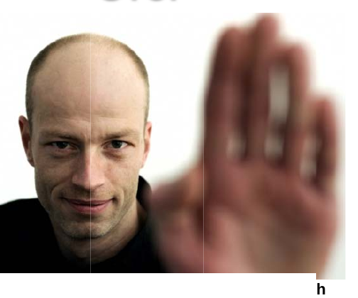

# Staying Safe

*Traffic control hand signals*

Being safe should start with your appearance and your preparedness for weather conditions. Wearing a reflective vest, carrying a lighted baton or flashlight, and the use of a whistle will help ensure you are seen by motorists and pedestrians. You must also take into consideration the air temperature; if you will be directing traffic for an extended period of time, ensure you are dressed warm enough during winter conditions, including wearing a hat and gloves. In hot weather, you should arrange for a hat to protect you from the sun and ensure you have access to plenty of water to remain hydrated.

Your position relevant to traffic flow is very important. You need to be visible to traffic from all directions in order to remain safe, and to be effective in your duties. In an intersection, you may be safest in the middle, where all lanes of traffic can see you. If you are directing traffic in or out of a parking lot, stand near the middle of the roadway where inbound and outbound traffic are moving, so that you are noticeable to traffic from both directions. Use traffic cones or barricades to help funnel traffic to where you are able to direct it.

Establish eye contact with drivers before signaling them through the intersection. If the area is congested or traffic patterns are confusing, drivers may be busy trying to orient themselves and avoid collisions. You cannot assume you have been seen. By establishing eye contact, you confirm the driver has seen you, and it is safe to direct the driver where you want them to go.

Using Signals

Most drivers will understand the following traffic direction signals:

STOP Go

1. Identify the vehicle you need to stop 1. Identify the vehicle you want to

2. Make eye contact with the driver proceed

3. Extend your arm, point to the driver, 2. Make eye contact with the driver

then lift your palm, facing it toward the 3. Extend your arm toward the driver,

driver (indicating stop) bend your arm at the elbow, bringing eee eee eee

your palm toward you (to signal come

4. Hold your palm toward the driver for as forward)

long as you wish them to remain

stopped 4. Maintain palm extended (indicating stop) to drivers coming from directions which would cross paths with the car you have directed to move forward

TURN RIGHT OR LEFT PEDESTRIAN TRAFFIC

© 2010. iStock #13915488. Used under licence with iStockphoto®. All rights reserved.

1. Identify the vehicle you want to make a 1. Make eye contact with pedestrian

Fight or left turn 2. Keep pedestrians off road until traffic
2. Make eye contact with the driver has moved, or is stopped
3. Point arm in the direction you want the 3. Use the same hand signals to direct
driver to turn, bending slightly at the pedestrians as you use for vehicles
elbow

4. Maintain palm up and outward to traffic approaching from other directions (indicating they should stop while the driver makes the turn)

Whistle Signals

• One long blast — used to tell the driver or pedestrian to stop
• Two short blasts — used to tell the driver or pedestrians to proceed
• Short, rapid blasts — warning signal

• One final note regarding traffic control; emergency vehicles have right of way over all
other vehicular and pedestrian traffic. Assist their arrival by bringing all other traffic to
astop and maintain until all emergency vehicles have passed.

Dl
