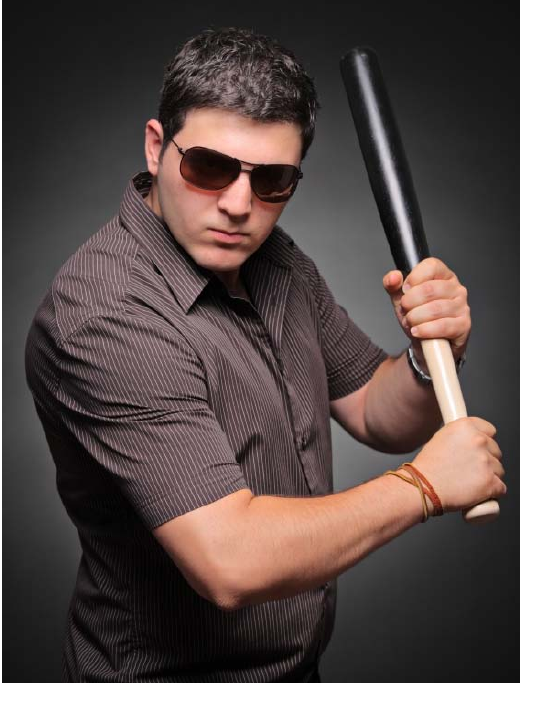

# Use of Force Response

*Use of force response illustration*

A key ability for any security professional is to be able to apply critical thinking to situations as they arise. As stated before, your job is to observe and report; carefully consider whether or not a call for the police to intervene will suffice. Consider the seriousness of the situation before stepping in on your own.

rr

In Module Two, you examined where the Criminal Code permits you to use force in your role as a security professional. As this is a very important topic, we will take a second look at what the Code says:

Section 25(1), CC Protection of persons acting under authority

25. (1) Every one who is required or authorized by law to do anything in the administration or enforcement of
the law

(a) as a private person,

(b) as a peace officer or public officer,

(c) in aid of a peace officer or public officer, or (d) by virtue of his office,

is, if he acts on reasonable grounds, justified in doing what he is required or authorized to do and in using as much force as is necessary for that purpose.

© Government of Canada (1985). Criminal Code. Reproduced with permission by Federal Reproduction Law Order.

As a security professional you are addressed in s. 25(1)(a) and s. 25(1)(c) as above, provided you act on reasonable grounds “using as much force as is necessary for that purpose.”

Ideally, you will not resort to using force to resolve a situation. Most times, utilizing effective verbal and non-verbal communication strategies will be sufficient to bring an individual into compliance with your request. In Module Four “Communication for Security Professionals,” you will learn various types of communication methods which can help you accomplish your goal. It is commonly said that 80% of situations can be addressed without using force; this means that the majority of the time, you will not need to escalate to the use of physical force in your interaction.

Choosing to use force depends upon several factors, including your own preparedness, the situation at hand, and the individual to whom you will apply the force. Let's look at how each of these should be considered in your decision making process.

How Prepared are You?

Before choosing to use force, consider the following about yourself:

• Age, level of fitness, and strength — how does this compare to the individual you
are dealing with?

• Injuries or health concerns — how will these affect your ability to apply force? What
risks do these conditions pose to your own well-being in the event of a struggle?

• Fatigue — are you nearing the end of an overnight shift? Are you mentally alert and
physically strong enough to prevail?

• Skills — do you have the appropriate skills? Have you completed use of force training? NOTE: if you are required to carry equipment such as a baton, you must take the appropriate training in order to become certified to do so. YOUR EMPLOYER MUST APPROVE YOU TO CARRY THE EQUIPMENT. This course does not provide that training.

• Confidence — how confident are you in your ability to use force in the situation at
hand?

What is the Situation You are Facing?

• Threats to safety of others — in situations where an individual is a threat to the safety of others or yourself, you should attempt to stop the problem behaviour. You will need to ensure that your actions do not pose further threat to the well-being and safety of nearby persons.

• Urgency — you may not have time to properly assess the situation, as in the case
where there is an immediate threat to safety; as you gain more experience, you will
be better able to make this call.

• Environment — how will the lighting conditions, weather, surface (e.g., slippery
ground, being at height), or the presence of bystanders affect a decision to use
force?

What do You Know About the Subject?

• Weapons - is he in possession of a
weapon, or of an object which could be
used as a weapon?

• Age, fitness, strength — what can you tell about the individual? Is he half your age and twice as big? Are you much larger and stronger than the subject?

• Mental state — does the subject appear to be affected by an altered mental state? How will this affect his decision making or perceived strength?

• Under the influence — does the subject
appear to be impaired by drugs or
alcohol?

Using force is a very serious matter; you will need to be able to justify your actions, document the events, and respond to questions and challenges which may arise as aresult. Utilize the following process to aid you in making your decision:

© 2010. iStock #7362461. Used under licence with iStockphoto®. All rights reserved.

rr

resolving the

necessary?

situation without force

situation without force

longer resisting or using force

rr

Excited Delirium

There is a rare medical condition which causes individuals to behave in a manner that is very disorderly and violent. The condition is known as excited delirium and is known to occur as a result of the affected individual being restrained, as happens when a person is arrested or detained. While it is likely you will never encounter an individual in a state of excited delirium, it is important for you to be able to recognize the condition as it is an emergency situation and can lead to death. Call for emergency assistance immediately if you believe an individual is in a state of excited delirium.

Indicators that an individual may be experiencing excited delirium include the following:
• Unusual physical strength

• Bizarre or aggressive behaviour, violence

• Overheating

• Sweating

• Aggression

• Shouting (nonsense)

• Paranoia

Excited delirium can be caused by

• = Illegal drug use, particularly cocaine
• Heart-related disease and conditions
•  Anti-psychotic medication

• Metabolic acidosis (a medical condition)

Death as a result of excited delirium has, in some cases, been associated with the way an individual is positioned when being restrained. To prevent this, ensure you do not position the restrained individual in such a way as to put pressure on their chest (which interferes with breathing) or push their face down in such a way their airways (mouth and nose) become blocked. If you find yourself in a position where you must restrain an individual, you should have them seated in a chair or propped up against a wall or other appropriate object/surface. Remember that if you have arrested an individual, you are obligated to turn them over to the custody of police or a peace officer as soon as possible.

rr
