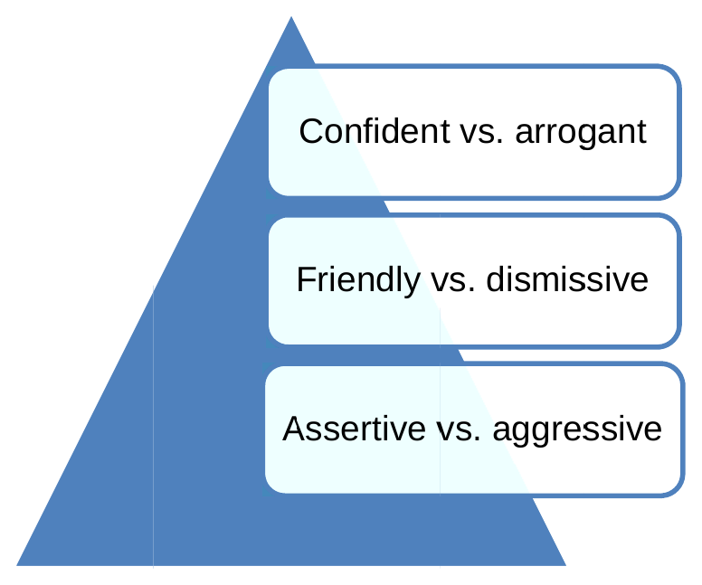

# Verbal and Non-Verbal Communication

*Verbal/non-verbal communication illustration*

As you have started to learn, being an effective security professional requires you to interact with members of the public at times when what you have to say may not be what they want to hear. Good thing there are other ways of communicating your message!

You will have many opportunities for verbal communication while on the job. Typically, you will engage in conversations

• in person

• by telephone

• over the radio

You may speak with your supervisor, other employees at your organization, your employer's client, personnel located on the site, the general public, and members of the law enforcement community. You are easily identifiable in your uniform and your responsibilities are generally understood by most. Your behaviour — which includes your

verbal communication style — should be a positive reflection on the company and industry you represent. Professional verbal communication is:

• Clearly understood; this includes speaking at a rate at which you can be understood,
and being careful to enunciate your words

¢ Courteous and respectful; remember to say please and thank you when appropriate
• Free from slang, racial slurs, and profanity

• Direct and to the point

• In plain language, free from complicated words or unique acronyms

A key to your success in verbal communication is your voice. Your tone of voice and the

volume of your voice send a message to the person(s) you are speaking to. Use a tone of voice which is

Confident vs. arrogant

Friendly vs. dismissive

Assertive vs. aggressive

Dl

What does each of these mean?

Confident Is calm and collected; it assures the listener you know what you are talking about. In emergencies, a confident tone will be helpful in convincing others to follow your direction.

Arrogant Is trying to show you are in a position of power over the individual because you possess more knowledge or influence over a situation; it is not a useful technique when trying to gain cooperation and can cause the listener to be resentful or disrespectful of your actions.

Friendly Is being approachable; if people feel they can come to you with their questions they are more likely to bring concerns or other information to your attention as situations arise.

Dismissive Is showing you are disinterested in what is being said; it is the same as “brushing off” the individual. They will take this as a sign you do not care, and will be less likely to come to you in the event something happens.

Assertive Is when you make your requests in a confident, straightforward manner. Aggressive Is forcing your request, opinion, or agenda on another party. It is

often viewed as forceful behaviour and will generally not result ina positive interaction.

The volume of your voice also sends a message in addition to the words being said. Try to use a normal, conversational voice in your interactions on the job. Speaking too quietly suggests you are timid; this is not how you want a trespasser or intruder to perceive you, as they may not take you and your role seriously. On the other hand, using a loud voice or shouting is often perceived as threatening or aggressive behaviour. This soft® may be appropriate in some circumstances, for example, when you are speaking to an individual from a distance, or when environmental noise levels require you to raise your voice so you can be heard. It is, however, not professional for you to raise your voice above a conversational volume when having a face-to-face interaction in a setting where you are not competing with other sources of noise. Use your confident, assertive tone of voice to convey the message that you mean business rather than escalating to screaming and yelling; you will appear more professional and, therefore, more worthy of respect.

Studies into the way humans communicate have suggested that as much as 90% of the meaning we derive from our communication with others comes through non-verbal means (Wertheim, 2008). Our non-verbal communication is made up of four different components:

Dl

Visual

Visual communication is another word for body language, and includes

• Facial expressions
• Posture
• Eye contact/movement

• Gestures

Tactile

Refers to using touch to help convey meaning, and includes

• Handshakes
« Paton the back
• Hugs

Vocal Mainly concerns tone of voice, which can be _—# changed to suggest • A question — ¢ Disbelief

• Seriousness

¢ Excitement
• Anger

Use of time, space, and image

We communicate through our respect for time, space, and through the way we present ourselves

• Being on time vs. being late
• Standing in another person’s “bubble”
• The way we dress

Microsoft®

You will most likely engage in non-verbal communication with other individuals

before you ever say a word.

Most people will recognize your role as a security professional as a result of the uniform you wear, the equipment (e.g., radio) you carry, or both. In some cases, the message communicated by your appearance is all that will need to be said; most people will respect your presence and generally not engage in any inappropriate behaviour. However, the strength of this message depends upon you. A clean, neatly pressed uniform worn properly (including appropriate footwear and outerwear), good posture, and an engaged (meaning you are aware of your surroundings and show interest) facial expression send a message that you are at your post and actively on duty.

A security professional has a very public role; after all, the client would not hire your employer's company if they were not concerned about unauthorized individuals gaining access to the persons and property you are tasked with protecting. Although you may work a post where the public are accepting of the boundaries, itis © 2010. istock # 14190754. Used under licence not uncommon for individuals to approach with iStockphoto®. All rights reserved. security professionals for the purposes of

gaining information, or for assistance when they have a problem. For example, a mother may come to you when she has lost sight of her child, or patrons at a sporting venue may ask you where to find the restrooms. While these types of incidents may not be the duties you are specifically assigned to carry out, you are required to provide a professional response. Remember that most people will view you as a professional who is able to assist; even if you are unable to leave your post or offer help, you can still respond in a courteous, helpful manner. Be careful that when doing so, your non-verbal communication is complimentary to your role as a professional. In other words, when approached for help — even when the question is clearly beyond the scope of your duties — provide a polite response. Do not roll your eyes, sigh, allow your shoulders to droop, or use an annoyed tone of voice. All of these non-verbal communicative behaviours will send a negative message to the individual you are interacting with and they, in turn, will use that to form their opinion about you and about security professionals in general.

Then there are the times when you will deal with an individual who is trying to challenge your authority and the boundaries which have been established by your client. Your first tactic should be to use your verbal communication skills (enhanced by appropriate non- verbal communication) to resolve the situation. A method known as LEAPS comes from a communication style known as Verbal Judo (Thompson, 2004) and is intended to be used for gaining cooperation and compliance.

rr

Le A Pesos

When using LEAPS, you take all of the action steps above, using them in the order they are listed. It may seem like a time-consuming process, but you can practice LEAPS in your everyday life and after doing so for some time, it will become an instinctive process for you. Taking a little extra time to use the LEAPS method in your communication may save you the amount of time it takes to resolve a situation which escalates further out of control.

Be an “active listener” while the individual is talking to you. Active listening is, quite simply, paying full attention to the speaker. This means you are hearing each word being spoken in addition to paying attention to any non-verbal communication. When you are actively listening, it is obvious to the speaker you are paying attention and, therefore, respected. In some cases, respectfully listening while the speaker presents his or her case may be enough to gain the compliance you seek. Here are some tips for active listening:

• Make eye contact with the speaker

• Nod or acknowledge certain points, when appropriate,
to show you are paying attention

• Do not “tune the speaker out” by looking around or by paying attention to other distractions (e.g., flipping through your notebook, saying hi to other passersby, or looking at your watch)

• Do not interrupt; if you did not understand something,
wait for the speaker to pause, then ask for clarification

Dl

<<activity form>>

Active listening exercise

You will work on this activity with a partner. One of you will read the first paragraph below while the other listens; the listener should NOT be looking at this manual while the speaker is talking.

The speaker will read through Active Listening Paragraph #1; when the speaker has finished, the listener will repeat it back, word for word. If the listener is unable to repeat it back, the speaker should read the paragraph again, but stop at the second last sentence. The listener will then try to repeat the shorter paragraph back, word for word. Continue this pattern (the speaker should shorten the paragraph by one sentence with each read through) until the listener is able to repeat back the paragraph, word for word. After the listener has been successful in repeating back the information, the speaker and listener should switch roles, and repeat the exercise using Active Listening Paragraph #2.

Active Listening Paragraph #1:

| need to get into my office on the third floor. | work in the accounting department and | do not have my staff ID with me. | just need to pick up some files which | forgot to take home. The security guard who used to work here would let me in at night all the time. | have worked here for several years and | don’t understand why you need to see my ID. | don’t want to drive home just to get my stupid ID. It would be a lot easier if you would just let me in.

Active Listening Paragraph #2:

The site manager called and asked me to come over here and check out the broken air conditioner. He said | didn’t need to stop at the guard shack. | have another job to get to and | don’t have time to waste waiting for you to call. The guy’s name was Mike so just blame him if you get in trouble. Look, can | get going now? It’s not my fault if nobody told you | would be here. You're going to get a bill from my company for my time so why not just let me do my job?

To empathize with other people is to try to understand the situation from their perspective. This is not the same as being persuaded to feel the same way they do. For example, you may be on duty at a scene where a fire is occurring inside a public building. An individual may try crossing the perimeter barrier because they believe a close friend may be inside and in danger. Your orders are to keep all non-emergency personnel from entering. You may tell this to the individual who is trying to gain access and they may ignore you, or become upset when you prevent them from entering. To empathize with this individual, you

Dl

may try to imagine how afraid they are feeling about the situation and it might help you understand how his or her judgment is being affected by fear. You would not change your mind about permitting access, nor allow the individual to enter. Instead, you would show empathy by saying “I understand you are probably very worried about your friend and you want to find out if everything is okay. If | let you go inside, | could be putting you in a place of danger, or, | could be putting you in the way of the people who are here to help. Neither of these situations will help your friend. | know it is very hard for you to wait and wonder, but the best way you can help is to wait out here, where it is safe.”

It stands to reason, however, that it may be difficult for you to empathize with the speaker. You may encounter an individual who is stealing items for the purpose of selling the goods in exchange for money to buy drugs. This may be very offensive to you and you may struggle to find a way to see the situation from the other person's perspective. Try not to focus on the motivation (drugs) and instead, view the individual as a person who sees no other options and feels they are in a desperate position. You may find it easier to relate in that way. Again, empathy is not the same as feeling sorry for someone; it is simply trying to figure out why the person is behaving in a certain way so that you can use that understanding to develop an effective communication plan.

Make sure you understand what the other person is saying to you. There is nothing wrong with asking the individual to repeat something you could not hear or to clarify something you do not fully understand. Be polite; the person may already be aggravated by the circumstances and you do not want your questions to add to the individual's level of frustration. When asking for clarification:

• Do not make the person feel stupid or inept; try saying
“Will you please say that again? | was unable to
understand you clearly.”

• Be clear as to what you need clarification for; the individual may question whether or not you were even listening if you are not specific as to what information you are asking for.

rr

When you paraphrase, you are taking what the speaker said and repeating it back using your own words. There are two advantages to doing so; it shows the speaker you were listening, and you are able to double check you have understood correctly. Many times, misunderstandings which occur during communication can lead to greater conflict. Paraphrasing will help minimize this risk.

At the end of the conversation you should summarize what has been discussed, including repeating any action steps which you or the speaker will be taking. For example, if you have denied access to an individual who failed to produce the right ticket to an event, you may summarize as follows:

“Just so we are both clear, | am not able to allow you entrance to the floor seating because you do not have the proper ticket. You have told me you have the right ticket but it is with your girlfriend, who is already in the seating area. You are going to move to the side and call your girlfriend on her cell phone and she will meet you here, with your ticket. Once | am able to confirm you have the right ticket, | will admit you to the seating area. Do you understand?”

By summarizing, you have made your expectations clear and you have provided options (e.g., get the ticket back from the girlfriend or sit in another area) to the individual. It also provides a polite signal that the matter is no longer up for discussion.
