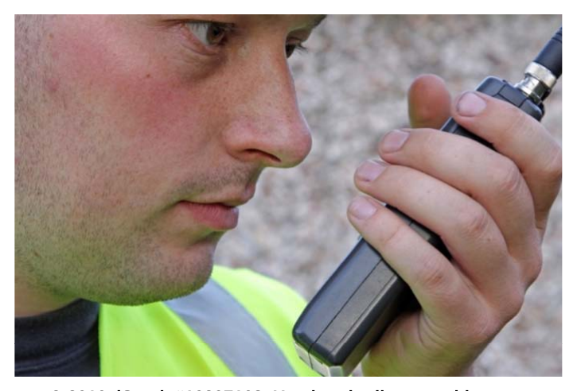

# Reports

*Reports illustration*

As you are continually reminded, a security professional is required to observe and report. It should not come as a surprise to you at this point that you will indeed be responsible for the completion of reports for your employer, the Solicitor General and the Ministry of Public Security, or other users.

A report may refer to anything from a routine form filled out for every shift to a lengthy document detailing the events of a particular incident. Some types of reports which you may encounter are:

• Sign-in/sign-out sheets
¢ List of deliveries

¢ Maintenance requests
• = Shift reports

• Incident reports

rr

Some employers require you to complete specific reports at the end of each shift, or to report problems with the facility (e.g., water leak) or safety hazards (e.g., lifting floor tile). You will need to complete a report when criminal activity occurs; your report may be used by the police in support of their investigation.

As with your notebook, reports should be accurate reflections of what took place and free from personal opinion and irrelevant detail. Another person should be able to read your report and have a clear understanding of what transpired. Reports should be written using correct grammar and handwriting or printing which is neat and easily read. Complete reports include information as to the date, location, and source from which information was gathered.

Additional pointers for a well-written report:

• Use the past tense — this means using words like “called, ran, shouted, looked”
which indicate the action took place in the past.

• Think about your senses — when writing details, remember to include what you saw,
heard, smelled, etc. if it is relevant to the incident you are writing about.

• Use short sentences and uncomplicated language.
• Organize your writing by reporting the events in the order they occurred.

• Refer to your notebook to ensure you have captured all the relevant details in your
report.

•  Ifit is helpful, include a diagram.

• Give your report to your partner or a co-worker; ask them to read it over, checking
that it is clear and appears complete.

<<discussion form>>

Group discussion

The instructor will divide the class into three groups and assign one of the incident reports (below) to each group. As a group, read your assigned incident report and discuss how well the report follows the guidelines you have been given in this module. Then, discuss the following:

• Does it cover the “who, what, where, when, why and how” information?
• Is the report detailed enough? Too detailed?

• Is the report complete?

• How useful will the report be for the investigation?

• Is any important information missing from the report?

• Is the report well organized? Is it easy to understand what took place?

Dl

Report #1

Incident Report Prairie Mall Date: October 3000 River Avenue Time: 11 AM Simpletown, AB Prepared by: Jane J. Officer

Around lunch on Tuesday | was checking out some new coats at the boutique when a lady came up to me saying something about her purse being taken. They didn’t have any blue coats in my size. Her outfit didn’t match and she was wearing a weird hat with a flower on it. She was a bit kooky looking and | thought she might cry. She was wearing black and white stripe pants, a top with yellow flowers, brown shoes and a floppy hat that had the flower on it like | said. | didn’t see her with a purse. She was about 5'2” which | know because that is how tall my sister is and she had light brown hair like the lady who works in the lotto booth. She had a quiet voice and it was hard to hear so | hoped she wouldn't cry like it looked like she was gonna because it would be hard to make her talk then. She said some young people came along in the parking lot and asked her for directions to the hamburger place. | think she meant the one where they only have drive- thru which | ate at last weekend. It was early for lunch so | don’t know why the kids wanted to know that. The lady said the boy was asking for directions and a girl came beside her and pulled on her purse and took it away. Then the boy and girl ran away and she thinks they got into a red truck. | don’t know if it was a Ford or a GM because she never said but it was probably a GM because they are pretty popular here. Especially the ones with big wheels. My cousin has one.

| told her to wait in the store where | was and | used my cell phone to call police. They said they would send some guy over so | told the lady to just hang out with me until the police came. | kept checking out the store and looking at my watch and after about 15 minutes | figured the cops would be here so | told the lady to follow me back to the security office. The cops still never came for 10 more minutes. | don’t get why it takes them so long. After forever when they got there | just told them to talk to the lady about the purse and then | went to get a coffee to go with my lunch because break was coming tight away and | didn’t want to miss it because | needed to get back to my post.

Jane 7 Officer

rr

Report #2

Incident Report Prairie Mall Date: Tues 50CT2010 3000 River Avenue Time: 1116 Simpletown, AB Prepared by: Jane J. Officer | was approached by Mrs. MEREDITH at 1116 Tuesday morning. She reported her purse had been stolen. | called for the police to attend. The police arrived at 1151 and

spoke with Mrs. MEREDITH in the security office.

Mrs. MEREDITH gave her address as 123 Pine Avenue in Simpletown and her phone number is 480-555-1234.

Jane 7 Officer

rr

Report #3

Incident Report

Prairie Mall Date: Tuesday 50CT2010 3000 River Avenue Time: 1116 approx Simpletown, AB

Prepared by: Jane J. Officer

| was on my patrol of the mall on Tuesday and was approached by Mrs. MEREDITH at approximately 1116. She had been entering the mall through the south doors at approximately 1105 and was approached by two youths, one male and one female. The male youth asked her a question. As she was answering, the female youth grabbed the purse from Mrs. MEREDITH’s arm. Mrs. MEREDITH said she was caught off guard and was not able to hold on to her purse. The youth ran away into the parking lot. Mrs. MEREDITH said she thought they got into a red truck. Mrs. MEREDITH said the male was wearing a black hoodie and jeans and had a pierced eyebrow. She indicated he is very slim and guessed him to be 6’ tall. Mrs. MEREDITH said the female youth was wearing a denim jacket, black pants, and army style boots. The female was wearing a black cap and had long red hair. She said both youth were wearing sunglasses. Mrs. MEREDITH said she did not think anyone else witnessed the incident.

Mrs. MEREDITH was shaken up by the incident. | called the police from my cell phone and then asked Mrs. MEREDITH to follow me to the security office. | asked Mrs. MEREDITH if could call anyone for her but she said she would be okay. | waited with her until the police arrived at 1151. | stayed in the office while Cst. TAYLOR spoke with Mrs. MEREDITH. When Cst. TAYLOR left | let Mrs. MEREDITH use the office phone so she could call her husband to come pick her up. Mrs. MEREDITH’s husband arrived at the security office at 1223 and they both left immediately. | called Supervisor PENNEY to report the incident. PENNEY instructed me to complete the incident report immediately and fax it to him at his office.

Contact information:

Mrs. Margaret MEREDITH 123 Pine Avenue Simpletown, AB 480-555-1234

Cst. D. TAYLOR Simpletown Police Service 789 Center Street

Simpletown, AB 480-777-1234 (office) 480-777-4321 (cell)

Jane 7 Officer

rr

When you first begin working for an organization, make sure you understand the reports that are required of you, as well as the frequency, format, and number of copies. Some organizations will ask you to report at the end of every shift; other types of reports may only need to be submitted on a periodic basis. You will need to know which reports must be handed in at which time and how they are to be submitted. Is there a mailbox for you to put your reports in, or should they be faxed or emailed? The report format may refer to handwritten vs. computer generated reports. If your organization makes computers available, the expectation may be you will create your reports using word processing software, or by filling out pre-generated forms which are accessed through the computer. You will also need to know whom the reports should be submitted to. Does your organization want you to turn all reports in to your direct supervisor? Do you need to provide copies of certain reports (e.g., maintenance requests) to the client's designate? It is probably a good idea for you to retain a copy of your final report. If you have written your report on a computer there is likely a folder in which you may store an electronic copy. For handwritten reports, there may be a carbon copy that you are to keep or, you may need to make a photocopy for your own records. Having a copy to refer back to ata later date may be valuable if the original gets lost, or if you need to refresh your memory about a particular incident.

Traffic Collision Reports

Traffic collisions should, generally, be investigated by the police or a peace officer. However, it may be the case where you are present at the scene of a collision during the course of your duties; you should be prepared to record appropriate information for later use during the investigation. In cases where it is not required for the driver to report the accident to police (vehicle damage less than $1,000) it is still a good idea to make notes in case you are called upon to provide information at a later date. Even if the collision does not appear to be serious, it is good

practice to collect information and © 2010. iStock #10207168. Used under licence with note it in your records. iStockphoto®. All rights reserved.

Your employer may have requirements for accident reporting and may also provide the forms to record the information on. If you are not provided with forms, you should record the information in your notebook. You should collect the following information with respect to a vehicle collision:

• Name, address, telephone numbers (home and work) for each driver involved
¢ Driver licence number and insurance information for each driver involved
• Time, date, and exact location of the collision

• Licence plate numbers, make, model, year, and colour of involved vehicles

Dl

• Description of damage to vehicles
• Description of injuries to persons

• Name, address, and telephone numbers for witnesses to the accident

It is also helpful to create a simple diagram showing the direction each vehicle was traveling with respect to other features (e.g., intersection, stop sign) of the accident scene. You should also note the weather conditions at the time of the accident, as they may have been a factor in the collision. If you notice anything else which seems unusual or out of place (e.g., an open liquor container in the vehicle), make sure to include this information in your notes as well.

You should provide your name and contact number to the drivers at the scene as well as any police or peace officer who may be present. This will allow the parties to contact you if they require additional information.

Mandatory Reports to the Registrar

The Security Services and Investigators Regulation requires individual licensees to file mandatory reports in specified circumstances.

Section 3 Security Services and Investigators Regulation Individual licensee reporting requirements

3(1) An individual licensee who is arrested or charged with an offence under the Criminal Code (Canada) or the Controlled Drugs and Substances Act (Canada) or any other enactment of Canada must, within 24 hours, provide a report to the Registrar in writing of the arrest or charge laid.

(2) !f an individual licensee loses his or her licence, the individual licensee must, within 24 hours, report the loss to the Registrar in writing.

(3) An individual licensee must report a change in information described under section 18(a) or (b) of the Act to the Registrar in writing within 30 days of the change.

(4) If an individual licensee fails to comply with this section, the Registrar may cancel or suspend the individual licensee's licence or impose additional terms and conditions on the individual licensee's licence.

© Alberta Queen's Printer, 2010

24 Hour Reporting Window:

If you are charged with an offence under the Criminal Code or the Controlled Drugs and Substances Act or any other federal enactment, you MUST provide a written report to the Registrar within 24 hours of the arrest or within 24 hours of the charge being laid.

If you lose your licence, you MUST submit a written report of the loss to the Registrar within 24 hours. This is reported on the Update to Individual Licence Form.

Reports must be submitted on an /ncident Report Form (PS3750), available online from www.securityprograms.alberta.ca.

30 Day Reporting Window:

You must report changes in the information you provided to the Registrar at the time you applied for your license within 30 days of the change taking effect. Information which must be reported includes the following:

• Change of name

• Change of contact information

• Related training completed

• Changes to citizenship, immigration, or work permit docvuments

Changes to the above information should be reported using the Update of Individual License Form (PS3746) which is available online at www.securityprograms.alberta.ca.
