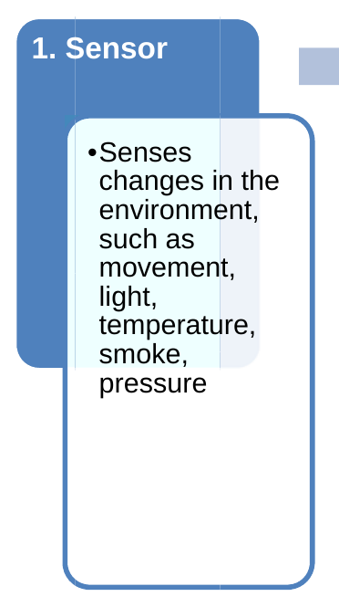

# Alarm Systems

*Alarm system components diagram*

An alarm monitoring system is a series of devices which serves to warn occupants and other individuals that an event outside of the “norm” is taking place. Alarm systems are physically attached within buildings and can monitor for events such as fire or entry by an intruder. There are also alarm systems which monitor for changes in the environment; these are commonly found in large buildings. Most commercial buildings and an increasing number of private homes utilize alarm systems. You should become familiar with the various types of alarm systems you encounter in your role as a security professional. Knowing how to read and respond to the indicators provided by the alarm will help you be more effective in your role.

Types of Alarms

Alarm systems may be used to detect or monitor the following:

• Fire (smoke)

• = Intruders

• Temperature

• Humidity

• Toxic substances (e.g., carbon monoxide)

• Water pressure, water leaks

• Pressure

• Equipment operation

Some alarm systems anticipate emergency events, such as an intruder or fire while other alarms monitor building operations, such as the temperature or humidity. Most buildings with sophisticated operation systems employ personnel for the monitoring of the systems and alarms. During evening or weekend hours, there may be an individual standing by “on call” in case of emergency or other event related to the building’s mechanical systems. Some sophisticated alarm systems are able to notify the building operator to an alarm by phone, or by email. Older systems may not be equipped this way So it will be incumbent upon you to know which systems you are to monitor; you will

need to monitor for alarms on a regular basis and contact the appropriate person(s) at the first indication of a problem.

How Alarms Work
An alarm system is made up of three primary components:
1. Sensor

2. Transmitter

3. Control panel

Dl

Information passes through each of these components in the order they are listed above.

Types of Sensors

*Senses *Sends the *Receives the changes in the message from information environment, the sensor to sent by the such as the control transmitter and movement, panel using initiates a light, hard wires, response temperature, telephone sequence smoke, lines,radio pressure signals, or

using wireless technology

3. Control
Panel

There are different types of sensors which can be used to monitor for events. The type of sensor used is dependent upon the information being gathered. For example, an intruder alarm will monitor for movement or other indicators of entry, such as a change in the amount of light in a room. Other types of alarms, such as fire alarms, monitor for the

presence of smoke or the increase in temperature which accompanies a fire.

Some sensor types with which you may become familiar are:

Photo sensors

Ultrasonic sensors

Magnetic sensors Magnets are placed on two surfaces to create a magnetic field. For example, one magnet is placed on the moving part of a window and the other magnet is placed on the window frame. The magnetic field is monitored by the alarm system. When the window is pushed open, the magnetic field is broken, initiating an alarm response.

Shock sensors An older technology, shock systems utilize a wire placed around the perimeter of a building opening, such as a window. The wire forms a complete electrical circuit which is monitored by the alarm system. When the window is opened, the wire is broken which interrupts the circuit and leads to the alarm being triggered.

Fire alarms Fire alarms may use different technologies to detect smoke and flame. Some alarms use photo sensor technology; when sufficient smoke accumulates, a light beam within the alarm becomes broken due to excessive smoke, and the alarm is triggered. Other systems use temperature sensors; a sudden increase in temperature will cause the alarm to activate. Still other systems use ionization technology, which involves monitoring the quality of air inside the sensor and triggering an alarm when the air quality changes beyond a pre-determined “normal” level.

Gauges You are familiar with gauge sensors such as the fuel level indicator or the speedometer in your car. Gauges are usually associated with building mechanical systems. A gauge most often has markings which indicate when the level is in a normal (or safe) zone or an unsafe zone. You may encounter gauges attached directly to equipment or fixtures or, like the instrument array in your car, you may find a display containing several gauges monitoring various functions. In older systems, gauges were generally monitored through visual inspection; newer technology is increasing the ability for systems to self-monitor.

Mechanical While this type of device does not “sense” information in the same manner as the sensors you have just studied, the fire alarm signal commonly found in schools and other public buildings acts as a sensor. When an individual pulls down on the handle, the movement triggers a response which sets off the alarm bells. Microsoft®

Transmitters

An alarm transmitter is relatively simple; its main purpose is to relay the information being provided by a sensor to the control panel. Some alarms use telephone wires; for example, the transmitter in some home security systems initiates a phone call to the alarm monitoring company, the police, or even both. Other systems, such as fire or smoke detectors, are hard wired between the sensor and transmitter, allowing the information to be transmitted by an actual physical connection. Wireless systems work

Dl

similar to the way you access Wi-Fi Internet service; instead of a router sending an Internet signal to your computer, the alarm transmitter is sending information to the control panel.

Control Panels

With respect to an alarm system, a control panel is not necessarily a physical object on which information about the alarm is displayed. Consider the smoke detector you have in your own home. When the alarm senses smoke, the device itself emits the shrill noise which attracts your attention. This is an example of a device where the sensor, transmitter, and “control panel” are all in one unit, in one location. In this example, the control panel is the functional part of the detector which is capable of creating a loud, attention-getting sound.

For other types of alarms, an actual control panel does exist. For example in many commercial buildings you may see a large wall-mounted panel which resembles a schematic drawing, with small lights placed at various locations within the drawing. Sometimes those lights are blinking, sometimes they are dim; in some instances, lights will be green unless an alarm is triggered at which point the light will turn red. There are many different types of control panels and the configuration of lights, drawings, indicators, and sounds on the panel will vary between manufacturers.
