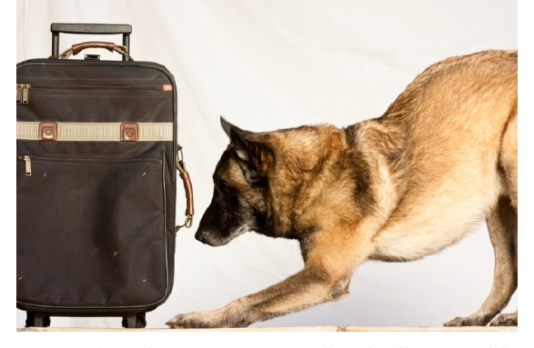

# Emergency Scene Management

*Bomb threat illustration*

*Bomb threats illustration*

*Next steps after bomb threat illustration*

When an emergency situation occurs, you will be looked upon to manage the safety and security of the scene. Emergency services personnel may direct you to take specific actions. Regardless of the role you are required to play, remain professional. This means you must be calm, utilizing your professional communications skills at all times, and continually observant. During a crisis, you are still responsible for the security of the persons and property you are assigned to protect. You will likely be one of the first people to arrive on scene if, in fact, you are not the one to actually discover the emergency. Persons on the scene will turn to you for guidance and you need to be

Dl

prepared to offer assistance. You will need to lead by example; if you struggle to contain yourself during an emergency, you will only hinder the efforts of emergency personnel.

While the occurrence of a major emergency is not particularly frequent, the implications of these types of events are rather large. The types of large-scale emergencies you can expect to deal with are:

• Fires

¢ Bomb threats

While the latter is much less common than fire, it is a serious situation and you need to know now — before it happens — how to proceed in the event such a threat occurs.

Fire

Fire is a common occurrence, if only on a small scale. Regardless of how large or widespread a fire becomes, the impact of smoke and heat upon persons and property can be quite significant. As part of your regular patrols, you should be constantly aware of fire hazards and other indicators which suggest a fire is imminent.

Preventing a fire emergency:

• Check that fire equipment (e.g., fire extinguishers) is in place and that emergency
exits are functional.

• Become familiar with the location of all emergency exits, including stairwells and
exterior fire escapes.

• Onyour routine patrols, you can check to see that fire escape doors can indeed be
opened and that access from both sides is not blocked.

• Familiarize yourself with emergency escape plans; if one has not been created for your site, it would be wise to check with your supervisor about doing so. If there are multiple facilities within your location (e.g., a college campus) ensure you are familiar with the escape routes for all areas.

• Ask if there are individuals within the building who may need assistance during an
emergency situation; this may include persons in wheelchairs, individuals with health
problems, and the visually or hearing impaired.

• Report hazards when you find them; overloaded plug sockets, uncleared piles of garbage, space heaters placed close to furniture, window coverings, or other items are unsightly (they take away from the professional appearance of the sight) and potentially dangerous. Clear up what you can (e.g., pulling a heater away from a curtain) to help eliminate the hazard.

• If smoking is permitted, ensure smokers are using ashtrays to dispose of their cigarettes; if the ashtrays become damaged and unusable or they go missing, file the appropriate maintenance report or advise your supervisor. Put an entry in your notebook to indicate the report was made.

• Pay attention to fire and smoke alarms; if you see evidence of tampering, file the
appropriate maintenance report or advise your supervisor. Put an entry in your
notebook to indicate the report was made.

Dl

• Make note of occasions when you find stoves or hotplates left on when nobody is around; make note also if you see evidence of candles being used (many facilities do not permit burning of candles — check what the role is at your location). Include these occurrences in your shift report to your supervisor who will follow up with the client.

When a Fire Occurs

If you discover a fire has started, you should immediately activate the fire alarm. Check the area for occupants and clear all persons from the building immediately. Closing doors and windows will help keep the fire from spreading to other areas. Carry out any other directives contained in your post orders in the event a fire occurs.

Only when all persons are safely removed from the area should you assess whether or not you should attempt to put the fire out. Your decision to try putting out the fire on your own should be based upon:

• The size of the fire — only attempt to put out a very small fire on your own

• The availability of appropriate equipment for putting out the fire and your training to
use such equipment

• The presence of dangerous chemicals — do NOT stay in a room where fire and
chemicals coexist

• The presence of an escape if you are unsuccessful in trying to extinguish the blaze

Carefully consider all of these options, keeping in mind your first responsibility is still the protection of persons and property. You may be providing a more important service to the client by remaining with the evacuated occupants.

Steps to evacuation:

1. Regardless of the type of emergency, the principles for safe, efficient evacuation are
generally the same.

2. Remain calm and professional at all times.

3. Do not shout; you may need to speak louder in order to be heard but try not to
escalate to anxious yelling.

4. You will know the location of the emergency exit(s) from your earlier patrols. When
an emergency occurs, look to the nearest emergency exit, check to see that it is safe
to use. If not, identify the next closest emergency exit which may be safely accessed.

5. Instruct persons as to the location of the nearest usable emergency exit. Identify a meeting place a safe distance away from the building and have all individuals gather there to await further direction. Instruct the evacuees to move swiftly and calmly, but not to run.

6. Make arrangements to evacuate individuals with mobility needs and other conditions
which may hinder their escape. If you must remain at the location, instruct another
individual to aid with the evacuation.

rr

Not all fire extinguishers are created equal...

While the scope of this course is not meant to be a comprehensive study in fire and fire management, it may be helpful for you to have a basic understanding of fire types, and the appropriate response to each.

Portable fire extinguishers come in several varieties based upon the type of fire they are most suited to putting out. The individuals who purchased and installed the fire extinguishers at your location should have selected equipment most suited to the environment; however, as time goes on, well-meaning individuals may replace equipment, or the original equipment may go missing. Knowing how to tead the fire extinguisher itself will be the best indicator as to whether or not the device will be an effective tool in fighting the fire at hand.

Microsoft®

The types of fire are:

A Ordinary combustibles
• Paper, wood, fabric

B Flammable and combustible liquids
• Fuel, oil, paint, grease

Cc Electrical fire
• Wiring, fuse boxes

D Metals

• Flammable metals such as magnesium and sodium

You must use a fire extinguisher which is rated for the type of fire you are dealing with in order to be effective in your efforts.

A cclass BC-rated fire extinguisher will NOT put out a class A fire; you must use an A- rated extinguisher.

Fire extinguishers are clearly labelled with respect to the class of fire they should be used on.

To use a fire extinguisher, follow the PASS method.

put the pin on the extinguisher or remove the safety catch as directed on the unit A™ the nozzle at the base of the fire

GovEEZE or press the handle

sv the nozzle from side to side, spraying the contents at the fire

Dl

Bomb Threats

A bomb threat is a situation wherein you receive notification about the alleged presence of an explosive device at your location. They are uncommon and often they are a hoax. However, since you will not know how genuine the threat is when it is received, you must treat every bomb threat as a real and very serious situation. Your organization or the client organization may have a bomb threat protocol in place. Inquire about this when you begin your post at the location and familiarize yourself with the requirements. If there is no protocol, remaining calm and thinking “on your feet” will be two strategies you should use.

People make bomb threats for various reasons. Some individuals are angry or feel vindictive toward the organization located at the site where the threat has been made and may want to hurt people by using the bomb, or using the threat of one. Some bomb threats are the result of an individual having information they are too afraid to take to the police; for example, a person may be somehow related to an individual who has threatened or has actually gone so far as to build a bomb. This person may be too afraid to come forward with the information but is also concerned about the safety of others. Calling in a bomb threat brings attention to the matter and provides a warning of potential danger.

Some potential reasons for a person to make a bomb threat are:

¢ Political statement — some individuals use bomb threats in protest of a particular political position

Microsoft®
• Revenge — a bomb threat creates chaos

and disruption; an individual may use a bomb threat as a means of seeking revenge and causing difficulties for the target organization

• Eco-terrorism — more frequently, industries and businesses which disrupt the
environment as part of their business practice have been targeted with explosives
(e.g., gas pipeline explosions)

• Activism — special interest groups will capitalize on the attention which comes with a
bomb threat

Negative media attention has been brought against certain industry sectors in our province, and while it is unlikely you will deal with bomb threats on a frequent basis, you need to have an awareness and alertness toward these types of situations.

Dl

Bomb threats are usually made by telephone though on occasion, they come via mail or other hand delivery. The RCMP (2010) have developed various guidelines for dealing with a bomb threat which arrives by telephone, as well as a “bomb threat checklist” for gathering information from the caller while the threat is being made. The RCMP also suggest you should learn how to perform an initiate a call trace; they advise finding out how to do so before the time comes when it is required.

Guidelines for dealing with a caller making a bomb threat (RCMP, 2010):

Listen

Remain calm, be polite

Do not interrupt the caller

Obtain as much information as possible (see bomb threat checklist) Start a call trace while you are still on the phone (if possible)

If possible, notify your partner or supervisor of the call and request the police be called

Complete the bomb threat checklist and submit it to your supervisor as soon as possible

© 2010. iStock # 14190754. Used under licence with iStockphoto®. All rights

reserved. Dl

The RCMP bomb threat checklist is a document which allows you to record answers the caller provides and additional information you gather during the duration of the call. A sample bomb threat checklist based on the RCMP model might look as follows:

BOMB THREAT CHECKLIST

What time is the bomb going to explode?

Where is the bomb?

What does the bomb look like?

Where are you calling from?

Why have you placed the bomb?

Will you tell me your name?

Determine as much of the following information as possible

Sex Male Female Approximate age? Accent English French Other:

Voice Loud Soft Other:

Speech Fast Slow Other:

Clarity of Good Nasal Lisp: Other: voice

Manner Emotional Calm Vulgar Other:

Background noises heard:

Caller’s voice was familiar? [Yes [No

Caller is familiar with area? Why?

Personal details the caller revealed about his or herself?

After you have finished speaking with the caller, record the details of the call in your notebook, including the date and time of the call, and the exact wording of the threat (or as much as you can recall). Do not speak to anyone else about the call; doing so might incite panic, which will not help the situation.

Written Bomb Threat

As with a bomb threat by telephone, you should alert your supervisor and the authorities as soon as possible. Keep any packaging the threat arrived in (e.g., envelope, box) to turn over to police when they arrive.

eee

Next Steps After a Bomb Threat

Your job is to report the bomb threat to your supervisors and/or police in accordance with your post orders. Once this has been taken care of, you should continue your regular duties, but with additional vigilance and watching for suspicious items or behaviours. A decision whether or not to ignore the threat, search for the threat, or evacuate the premises must come from someone other than yourself.

Search

If a decision is made to search the premises, you may be called upon to assist based on your familiarity with the location. You will receive direction as far as how to search, where to search, and what to look for. In turn, you may be called upon to provide information to the police about areas which are easily accessed by the public, or areas where critical systems

are housed. If you are instructed to form © 2010. iStock # 10160412. Used under licence with part of the search effort, listen carefully to iStockphoto®. All rights reserved.

the instructions provided by the police or

the explosives experts — it could save your life!

If you see something suspicious, remember:

1. Do not touch it!
2. Do not move or change anything in the environment.

Do not use your phone or radio; electronic devices are known to detonate certain bombs. Move at least 50 metres away before activating an electronic device.

4. Move out of the area slowly; secure access to the area so no one is
able to enter.

5. Report your finding to your supervisor or designate (you may have
been instructed to call the officer in command). They will want to know

* Where the object is, including exact location and other details such as whether or not it is in/on a piece of furniture, what it is attached to (e.g., taped to a pipe), and how accessible it appears to be. Also, is it near a gas line? Water line? Server room?

* Adescription of the object
* Any obstacles or barriers to prevent access to the object

+ Asafe access route to get to the location

6. Stay alert for further instructions; continue to monitor access to the
site.

rr

You will be given instructions about how to proceed. Prevent additional persons from entering the area (unless they are members of the search/investigative effort). Make note of the nearest exits in case a quick evacuation or escape becomes necessary.

Best practices for searching

Search the public areas of the premises first; these areas are presumably more accessible to an individual trying to plant a device.

Search the evacuated areas, as well as the exterior of the premises.

Maintain a searched “cushion” between you, and the exit. This means try to ensure the area you would have to evacuate yourself through has been searched and declared clear. It is not desirable for you to be in a position where you would need to evacuate through an uncleared area.

Searching a room

Enter the room slowly.

Listen for unusual sounds; closing your eyes will enhance your ability to hear. You should listen for ticking, beeping, buzzing, or clicking noises.

Scan the room systematically, from left to right; start with the floor and scan everything up to waist level. Then, scan from waist level to ceiling level. Finally, scan the ceiling.

Look for objects which seem out of place or which are not usually there. You may notice a microwave oven door which is not properly closed, or a garbage can sitting on top of a table. A briefcase, backpack, or purse would not normally be left unattended in a public area.

Look for “hiding” spots; this could include heating or A/C vents, light fixtures, draperies, closets, under flooring, or in or behind objects attached to the wall. Do not handle these items; simply pay attention to see if they look as though they have been moved or disturbed, for example, a rug is not lying perfectly flat near one corner.

Use a note or tape at the entrance to a room/space to indicate it has been searched and cleared.

Remain in contact with your supervisor or the lead officer (if instructed to do so) to advise when rooms or areas have been cleared.

Evacuation

If you are instructed to assist with an evacuation effort ensure you understand what is being asked and how you are to direct the evacuees. Your assistance will be required to ensure a swift yet orderly exit from the premises for all persons at risk.

rr
