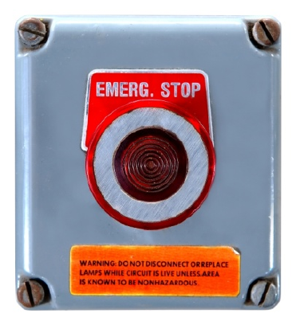

# Conclusion

*Emergency scene management illustration*

Alarm systems protect persons and property from intruders, fire, environmental emergencies and other undesirable events. An alarm system consists of a sensor, transmitter, and a control panel. It is good practice for you to familiarize yourself with the alarm systems in use at your post; take time to ensure you understand the expectations of you in the event an alarm is triggered. During an emergency, you will be looked to for leadership; remain calm and professional as you deal with the situation and aid persons who may be in danger. For specific

emergencies, follow best practices; in some cases, © 2010. iStock # 1862140. remaining with evacuated persons to await arrival of Used under licence with

‘ 5 iStockphoto®. All rights emergency services may be the most helpful option. reserved. References

Banner Engineering. (2010). iKnow guide to sensing (1“ ed.). Minneapolis, MN: Banner Engineering. eHow.com (2010). How does a fire alarm work? Retrieved October 17, 2010 from

http:/Awww.ehow.com/how-does 4964711 fire-alarm-work.html

Fire Prevention Canada. (2010). Fire extinguishers. Retrieved October 17, 2010 from http://www. fiprecan.ca/index.php?section=2&show=fireExtinguishers RCMP. (2010). Responding to bomb threats: Telephone procedures. Retrieved October

17, 2010 from http://www.rcmp-grc.gc.ca/tops-opst/cbdc-ccdb/telephone-

procedure-eng.htm

Dl
