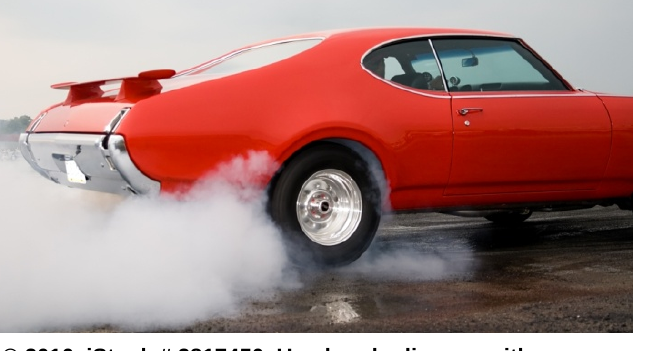

# Personal Safety

*Personal safety illustration*

*Emergency response illustration*

Personal safety begins with your own attitude and your preparedness for the role. Your physical and mental fitness are important to your personal safety even before you step foot on the work site. Use the same method of observing and assessing to determine whether you are fit to perform your duties prior to beginning every shift. If you are overtired, ill, or otherwise incapacitated, you are not only a hazard to yourself, you are a hazard to the persons you are supposed to be protecting and a liability to your employer. Be conscientious about wellness; get enough sleep to meet your needs, eat a healthy, balanced diet, address medical concerns with a health professional, and participate in activities which help you build and maintain your level of fitness. There is always a physical requirement of security professionals, even if you work a stationary posting most of the time; your level of fitness contributes to your ability to combat fatigue and can help keep your cognitive function and powers of observation sharp.

You should always wear and use any safety or protective equipment as required by your employer. Items such as steel-toed boots and reflective vests are meant to help ensure your safety in the presence of hazards. Keep your uniform in good repair; tears in the fabric or flaps of cloth are subject to getting caught in equipment or machinery which could subsequently lead to injury. Wear a jacket when patrolling outdoors in cold weather to protect you from the cold and the potential of hypothermia or frostbite. A water repellent coat is a necessity during periods of rain. When patrolling outdoors during the day, use sunscreen and wear a hat to protect you from the damage and ill- effects caused by the sun. This is true in winter, as well as summer.

Communication and Safety

Develop a habit of communicating with your co-workers or

supervisor on a regular basis while on duty. Checking in at

the beginning of your shift, before and after breaks, and at

the end of your shift lets others know you are at your post

and serves to benchmark (establish a standard) your

communication patterns. You may call more frequently if

time and circumstances permit. Your employer is partially

responsible for ensuring your safety, and will appreciate your

checking in on a regular basis. Microsoft®

You might also communicate with others during the course of your patrols. It may be individuals employed by the same organization as you, or it may be persons who work at various locations within the site. For example, it may become your habit to stop at the information desk each time you patrol the lobby area. There are at least two benefits to regular contact like this:

• You have an opportunity to ask if there are any concerns you should be made aware
of

• The individual(s) working the desk will come to expect your presence (and more
importantly, notice when you do not stop by, which may prompt them to have
someone check up on you)

rr

Safety and Your Duties

Throughout this course, you have looked at the various situations you may encounter while working as a security professional and identified best practices and strategies for dealing with each. It is impossible to predict all possible situations you will encounter, but one thing common to all sites you will work at is the existence of an associated level of tisk. For the purposes of this discussion, we will consider three broad categories of risk: low, medium, and high.

Low Medium High
Examples of low-risk Examples of medium-risk | Examples of high-risk
setting: setting: setting:
• Day shift e Evening shift e Night shift
• Posting in a non- e Parking lots during e Working in area with
hazardous location daylight hours high crime level
(e.g., lobby of an office =. Construction or ¢ Working around large
tower) industrial site during amounts of cash or
daylight hours valuable goods
• Venues with large e Working in settings
numbers of persons where there is a risk of
present violence (e.g., labour
dispute)

• Parking lot in darkness

¢ Construction or industrial site during hours of darkness

• Isolated location

• Areas with limited radio
or cell phone signal

You will need to assess the risk at each site you work. Other factors you should consider when doing a risk assessment include the potential for a risky event to occur (e.g., how likely are you to encounter a fire) and how frequently does the risk happen (e.g., how often do you need to remove trespassers from a construction site during the day?). For example, you might be posted at a medium-risk setting, such © 2010. iStock # 2817450. Used under licence with

as a parking lot during daylight hours, iStockphoto®. All rights reserved.

but because it is in an isolated location,

it is a popular place for drag racers to gather. At least once a week you must address a group of trespassers and ask them to leave the property. The regular frequency with which you interact with the racers elevates this setting into a potential high risk situation.

rr

Emergency Response

You have already learned about appropriate responses to various emergency situations and have been reminded that maintaining a professional composure by staying calm will provide the most reassurance to individuals at the scene. You have learned about monitoring crowd situations for signs of panic, stampede, and potential trampling of persons. You know to use respectful and polite verbal and non-verbal communications when dealing with angry or difficult persons. Facing an emergency situation simply requires you to utilize all of these skills and best practices at the same time. As you have read in earlier modules your own safety is paramount during times of crisis; if you are injured or otherwise incapacitated you will be unable to perform your duties and assist others in their efforts to get to safety.
