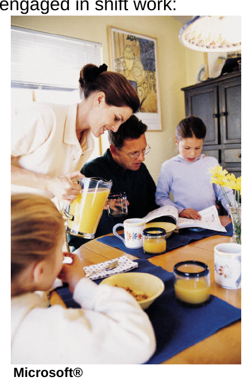

# Shift Work

*Physical fitness illustration*

*Sleep and exercise illustration*

Security patrols are often required during evening and night time hours, leading to the need for shift work amongst security professionals. Some of the most common negative effects of shift work include disruption of the circadian (sleep) rhythm, sleep deprivation, disorders of the gastrointestinal and cardiovascular systems, worsening of existing disorders, and disruption of family and social life (CCOHS, 2007).

Health and Nutrition

Shift work disrupts normal social patterns and routines, such as meal time. When shift work causes you to work through or skip regular meals, it affects your health and overall well being. Even though you may not be able to eat dinner with your family each night, you can still adopt eating patterns which will help you combat the negative effects of shift work. The Occupational Health Clinics for Ontario Workers (2005) recommend:

• Afternoon workers should have their meal in the middle of the day instead of the
middle of their work shift

• Night workers should eat lightly throughout the shift and have a moderate breakfast
• Relaxing during meals and allow time for digestion

• Drinking lots of water

• Cutting back on highly salted foods

• Reducing foods high in fat

• Maintaining regular eating patterns with well-balanced meals (avoid junk food and
limit fat intake)

• Eating the usual balance of vegetables, fruit, lean meat, poultry, fish, dairy products,
grains, and bread

• Avoiding excessive use of antacids, tranquilizers and sleeping pills
• Minimizing the intake of caffeine and alcohol

• Avoiding fast food and vending machines

rr

Physical Fitness

Physical fitness routines are often another casualty of shift work. You might normally work out at the time you are heading home from an overnight shift, or your evenings may be spent tending to your responsibilities to home and family, leaving no time for a workout. Fitness contributes to your ability to remain focused and alert on the job; being physically fit aids your energy levels which in turn sustain you through long shifts. Healthy U, an initiative of the Government of Alberta (2010) suggests shift workers try the following strategies for staying alert during late night shifts and maintaining physical fitness:

Try to exercise during breaks

der licence with

Talk with co-workers while you work iStockphoto®. All rights reserved.

Try to work with a "buddy"

Take short breaks throughout your shift to use the employee lounge, take a walk, shoot hoops in the parking lot, or climb stairs

Don't leave the most tedious or boring tasks to the end of your shift when you will probably feel most sleepy

Exchange ideas with your colleagues on ways to cope with the problems of shift work

It's a good idea to avoid exercising before going to bed, because exercise raises energy and your body temperature. Make sure you allow three hours to pass between exercising and going to sleep.

Sleep

The most obvious affect shift work has on your physical and mental well-being is the disruption to your regular sleep patterns. Despite your family’s best attempts to ensure you are not disturbed and your own good intentions, it is not an easy task to obtain a quality sleep during daylight hours when most of the world is awake. The following suggestions may help you get the rest your body needs:

Make sure your family and friends are aware of and considerate of your sleep hours and needs

Ensure you have a comfortable, quiet place to sleep during the day

Air conditioning, telephone answering machines, ear plugs and good window coverings are examples of devices which may improve your sleep

Make time for quiet relaxation before bed to facilitate better sleep (reading, breathing exercises, muscle relaxation techniques, etc.)

Sleep on a set schedule to help establish a routine and to make sleep during the day easier

rr

• Avoid strenuous exercise before sleeping as your body's metabolism will remain
elevated for several hours afterward, making sleep difficult

• If you do not fall asleep after one hour, read a book or listen to quiet music

• If sleep still does not come, reschedule your sleeping hours for later in the day
Adapted from Occupational Health Clinics for Ontario Workers, Inc., 2005

You will probably go through a process of trial and error until you discover what works best for you, but it will be worth it to get the rest you need. You will stay healthier, feel better, and have more energy for your work and personal life.

Social Life

Working shifts wreaks havoc with your social life. Even if you are not a person who typically goes out often you will still notice the way shift work infringes upon your personal or relaxation time. All of us require the balance brought to us by our “down time” and the freedom to choose what we want to do. Extended periods of working evening or night shift can cause you to lose contact with family and friends and lead to a feeling of isolation. The Occupational Health Clinics for Ontario Workers (2005) provide the following ideas for maintaining a social life while being engaged in shift work:

• Schedule at least one daily meal with your family; this
helps to keep communication channels open and
promotes good eating habits

• Socialize with other shift workers and their families;
this helps to minimize the disruption that shift work
can have on your social life

• Keep in touch with your spouse/partner and children
daily

• Set time aside for just you and your spouse/partner

• Carefully plan family activities; family ties are a
precious commodity (plan days off in advance if
possible)

• Practice stress reduction

Microsoft®

• Use acalendar to schedule events
• Try to prioritize tasks and tackle one at a time
Working shift work will cause you challenges but working to implement the strategies

and ideas you have just studied should help to ease your concerns and protect your health and well being both on and off the job.

rr
